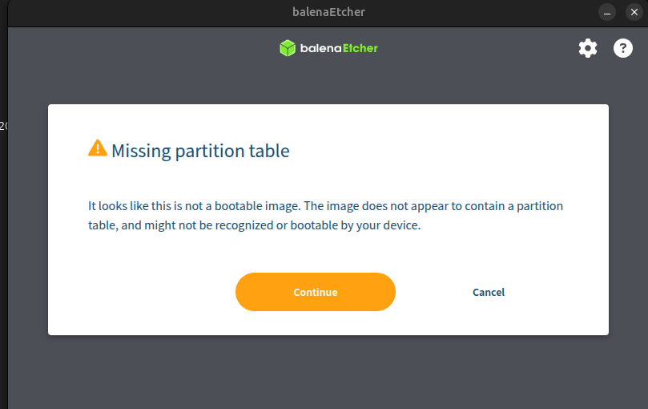

## **Fecha: 17/04/2026**

- Se crea el repositorio de github con la disposición general del mismo.
- Se sigue la guía subida en Teams por el profesor, para la creación de la primera imagen para la Jetson Nano. Se deja toda la noche creándose. Al día siguiente se nota que se creó una imagen de tipo qemux86-64, esto dado que se inicializó mal el ambiente, y el poky creó una nueva carpeta de build.

### Errores / Problemas
- Dentro del contenedor de docker, se usa el comando `source oe-init-build-env` en lugar de `source oe-init-build-env build-jetson`.


## **Fecha: 18/04/2026**

- Al tratar de correr el `bitbake core-image-base` este da un error. Se logra identificar que el poky kirkstone no es compatible con el target de la jetson nano. Es por esto que se decide pasarse al poky dunfell, el cual sí tiene la compatibilidad que se requiere. Se decide no eliminar el poky por completo, sino simplemente pasarse a la branch de dunfell del poky, el meta-openembedded y el meta-tegra. Además, dentro del `yocto-workspace/poky/build-jetson/meta-custom/conf/layer.conf` se debe de dejar de usar el kirkstone. Finalmente, dentro del local.conf, se debe de cambiar el CONF_VERSION = "2" a CONF_VERSION = "1".
- Luego de solucionados esos problemas, se está cocinando la receta `ollama-bin`, para luego cocinar la imagen completa nuevamente. Mencionar que el `local.conf` se le agregó una limitante del uso de recursos, además de la funcionalidad del ssh. El archivo actualmente se ve tal que:

```bash
# Limitar el uso de CPU durante la construcción
BB_NUMBER_PARSE_THREADS ?= "1"
BB_NUMBER_THREADS ?= "2"
PARALLEL_MAKE ?= "-j 2"

LICENSE_FLAGS_ACCEPTED += "commercial"

# Utilizar systemd como gestor de inicio (recomendado para despliegues con Ollama)
DISTRO_FEATURES:append = " systemd"
VIRTUAL-RUNTIME_init_manager = "systemd"
DISTRO_FEATURES_BACKFILL_CONSIDERED = "sysvinit"
VIRTUAL-RUNTIME_initscripts = "systemd-compat-units"

IMAGE_INSTALL:append = " ollama-bin"

EXTRA_IMAGE_FEATURES ?= "debug-tweaks ssh-server-openssh"
```

### Errores / Problemas

- Uso de una versión de poky no compatible con la jetson nano. Se pasa de kirkstone a dunfell. Además, se en este caso se estaba llamando con un nombre equivocado la receta, que debería ser `ollama-bin`. Al usar el comando `bitbake core-image-base` se recibía:

```bash
yoctouser@069dbef852fd:~/yocto-workspace/poky/build-jetson$ bitbake ollama-bin_1.0
ERROR:  OE-core's config sanity checker detected a potential misconfiguration.
    Either fix the cause of this error or at your own risk disable the checker (see sanity.conf).
    Following is the list of potential problems / advisories:
    MACHINE=jetson-nano-devkit is invalid. Please set a valid MACHINE in your local.conf, environment or other configuration file.
Summary: There was 1 ERROR message, returning a non-zero exit code.
```


## **Fecha: 19/04/2026**

- Se verifica que a lo largo de la noche se genera la imagen de manera satisfactoria. Esta se encuentra dentro del contenedor, específicamente en la ruta:

```bash
yocto-workspace/
└── poky/
    └── build-jetson/
        └── tmp/
            └── deploy/
                └── images/
                    └── jetson-nano-devkit/
                        └── core-image-base-jetson-nano-devkit.tegraflash.tar.gz
```

- Investigando, para poder hacer que la Jetson Nano bootee la nueva imagen, hay que hacer que esta se encienda en *Recovery mode*, para lo que hay que colocar un jumper en los pines J28. En este momento no se tiene el jumper, por lo que simplemente se decide cargar la imagen a una tarjeta SD de 64 GB usando [Etcher](https://etcher.balena.io/#download-etcher).

- Al tratar de hacer el boot con Etcher, se ve que este da una advertencia. Parece que no se puede copiar directamente la imagen de esta forma, sino que hay que hacerlo por medio de un cable USB conectado entre la computadora host y le Jetson Nano.

### Errores / Problemas

- No se puede copiar la imagen a la SD.

<figure style="text-align: center; margin: 20px auto;">
  
  <figcaption style="font-style: italic; color: #666;">Error al pasar la imagen a la SD con Balena Etcher</figcaption>
</figure>


## **Fecha: 23/04/2026**

- Investigando de manera algo más profunda, parece que no es necesario poner un jumper físico en la jetson nano, para hacer que esta bootee con una imagen nueva. El poner un jumper en el pin J28 más bien lo que hace es indicarle a la tarjeta que debe alimentarse con el cable de tipo barril, y no con el micro-usb. Actualmente solo se cuenta con el micro-usb, por lo que hay que usar este como alimentación.
- Investigando en la (documentación){} oficial, al flashear la imagen que provee Nvidia, hay que usar un monitor, mouse y teclado para configurar algunas cosas. Se cree que dado que se usa una imagen personalizada, esto no va a ser necesario.
- Dado que la vez pasada no se pudo flashear la SD con el etcher, se debe de alterar el contenido del `local.conf` para que este genere un archivo compatible con este software. Inicialmente se añadió la línea `IMAGE_FSTYPES:append = "wic.gz"`, pero esta daba un error, que se muestra en seguida:

```bash
ERROR: tegra-minimal-initramfs-1.0-r0 do_image_wic: No kickstart files from WKS_FILES were found: tegra-minimal-initramfs.jetson-nano-devkit.wks tegra-minimal-initramfs.wks. Please set WKS_FILE or WKS_FILES appropriately.
```
- Daba este y errores relacionados con una incapacidad de usar el tipo de archivo wic. Esto se trató de modificar para que funcionara, pero no se logró solucionar.
- Se vió que al tener el `local.conf` con este contenido, esta va a generar un archivo comprimido que después se puede modificar para generar la imagen.

```bash
IMAGE_CLASSES_append = " image_types_tegra"

IMAGE_FSTYPES_pn-core-image-base = " tegraflash tar.gz"

WKS_FILE_pn-core-image-base = ""
```

- Una vez se acabó el `bitbake core-image-base`, se generá el archivo `core-image-base-jetson-nano-devkit-20260423214527.tegraflash.tar.gz`. Este hay que copiarlo y pegarlo fuera del contenedor de docker. Una vez fuera, se descomprime y se debe de correr el siguiente comando:

```bash
sudo ./dosdcard.sh jetson-nano-sdcard.img
```

- Esto va a tomar los archivos relevantes de la carpeta recién descomprimida y los va a unificar en `jetson-nano-sdcard.img`, la cual se puede bootear a la SD usando etcher.
- Ya con la SD correctamente flasheada, esta se coloca dentro de la jetson nano. Inicialmente esta tarjeta no parece funcionar, al conectarla al router, no aparecen señales de que se esté conectando a este. Luego de ajustar algunos paquetes dentro del archivo de configuraciones, se logra que la tarjeta se vuelva visible, esto se verifica con:

```bash
# Comando para ver dispositivos visibles
for i in {1..254}; do ping -c 1 -W 1 192.168.100.$i | grep "from"; done
64 bytes from 192.168.100.1: icmp_seq=1 ttl=64 time=4.66 ms
64 bytes from 192.168.100.3: icmp_seq=1 ttl=64 time=0.063 ms
64 bytes from 192.168.100.9: icmp_seq=1 ttl=64 time=207 ms
# La primera dirección corresponder al router, la segunda a la computadora local y la tercera a la jetson nano
```

- El archivo `local.conf` tiene el contenido final tal que:

```bash
# Limitar el uso de CPU durante la construcción
BB_NUMBER_PARSE_THREADS ?= "1"
BB_NUMBER_THREADS ?= "2"
PARALLEL_MAKE ?= "-j 2"

# 1. Acceso y Tweaks
EXTRA_IMAGE_FEATURES += "debug-tweaks ssh-server-openssh"

# 2. Instalación de paquetes (Sintaxis Dunfell)
IMAGE_INSTALL_append = " \
    ollama-bin \
    openssh-sftp-server \
    packagegroup-core-full-cmdline \
    kernel-modules \
    linux-firmware-rtl8168 \
"

# 3. Forzar el uso de systemd y sus servicios de red
DISTRO_FEATURES_append = " systemd"
VIRTUAL-RUNTIME_init_manager = "systemd"
DISTRO_FEATURES_BACKFILL_CONSIDERED = "sysvinit"
VIRTUAL-RUNTIME_initscripts = "systemd-compat-units"

# 4. Habilitar red automática sin funciones de shell complejas
# Esto le dice a systemd-networkd que se compile y use
PACKAGECONFIG_append_pn-systemd = " networkd resolved"

# 5. Configuración de hardware (Lo que ya tenías)
IMAGE_CLASSES_append = " image_types_tegra"
IMAGE_FSTYPES_pn-core-image-base = " tegraflash tar.gz"
WKS_FILE_pn-core-image-base = ""
LICENSE_FLAGS_ACCEPTED += "commercial"
```

- No obstante, al tratar de realizar la conexión, esta falla.

### Errores / Problemas

- Error con el formato `IMAGE_FSTYPES:append = "wic.gz"` dentro del `local.conf`, esto para crear la imagen directamente booteable con etcher.
- Conexión fallida con la jetson.

```bash
ssh root@192.168.100.9
# Resultado
ssh: connect to host 192.168.100.9 port 22: Connection refused
```


## **Fecha: 24/04/2026**

- Se sigue tratando de dejar funcionando la funcionalidad de acceso a la jetson a través de conexión ssh, pero esto no se logra. Se quedó en un punto en el que la dirección ip de la jetson estaba visible, pero ahora, luego de algunos ajustes en el archivo de configuraciones, se volvió a perder esta visibilidad.

## **Fecha: 26/04/2026**

-  Se investiga y se elaboran las secciones de la 7 a la 10, de manera preliminar, del primer avance del proyecto. Estas se agregan en un documento latex, para luego exportarlo a pdf.
