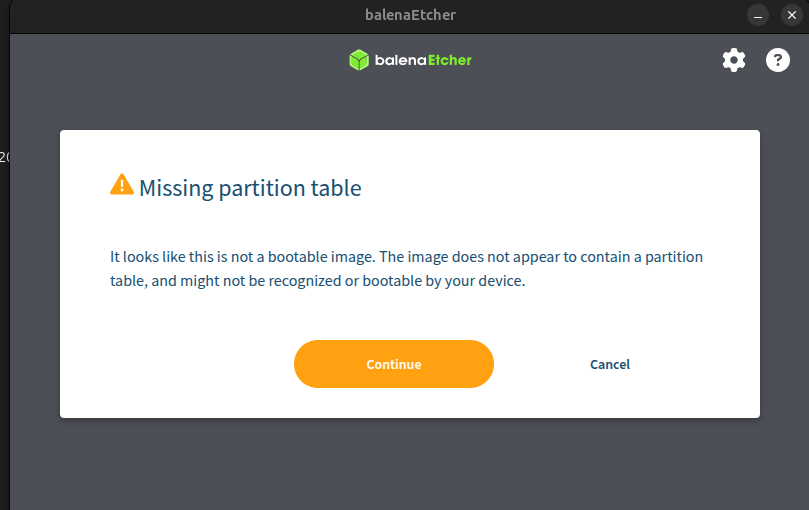

## **Fecha: 17/04/2026**

- Se crea el repositorio de github con la disposición general del mismo.
- Se sigue la guía subida en Teams por el profesor, para la creación de la primera imagen para la Jetson Nano. Se deja toda la noche creándose. Al día siguiente se nota que se creó una imagen de tipo qemux86-64, esto dado que se inicializó mal el ambiente, y el poky creó una nueva carpeta de build.

### Errores / Problemas
- Dentro del contenedor de docker, se usa el comando `source oe-init-build-env` en lugar de `source oe-init-build-env build-jetson`.


## **Fecha: 18/04/2026**

- Al tratar de correr el `bitbake core-image-base` este da un error. Se logra identificar que el poky kirkstone no es compatible con el target de la jetson nano. Es por esto que se decide pasarse al poky dunfell, el cual sí tiene la compatibilidad que se requiere. Se decide no eliminar el poky por completo, sino simplemente pasarse a la branch de dunfell del poky, el meta-openembedded y el meta-tegra. Además, dentro del `yocto-workspace/poky/build-jetson/meta-custom/conf/layer.conf` se debe de dejar de usar el kirkstone. Finalmente, dentro del local.conf, se debe de cambiar el CONF_VERSION = "2" a CONF_VERSION = "1".
- Luego de solucionados esos problemas, se está cocinando la receta `ollama-bin`, para luego cocinar la imagen completa nuevamente. Mencionar que el `local.conf` se le agregó una limitante del uso de recursos, además de la funcionalidad del ssh. El archivo actualmente se ve tal que:

```bash
# Limitar el uso de CPU durante la construcción
BB_NUMBER_PARSE_THREADS ?= "1"
BB_NUMBER_THREADS ?= "2"
PARALLEL_MAKE ?= "-j 2"

LICENSE_FLAGS_ACCEPTED += "commercial"

# Utilizar systemd como gestor de inicio (recomendado para despliegues con Ollama)
DISTRO_FEATURES:append = " systemd"
VIRTUAL-RUNTIME_init_manager = "systemd"
DISTRO_FEATURES_BACKFILL_CONSIDERED = "sysvinit"
VIRTUAL-RUNTIME_initscripts = "systemd-compat-units"

IMAGE_INSTALL:append = " ollama-bin"

EXTRA_IMAGE_FEATURES ?= "debug-tweaks ssh-server-openssh"
```

### Errores / Problemas

- Uso de una versión de poky no compatible con la jetson nano. Se pasa de kirkstone a dunfell. Además, se en este caso se estaba llamando con un nombre equivocado la receta, que debería ser `ollama-bin`. Al usar el comando `bitbake core-image-base` se recibía:

```bash
yoctouser@069dbef852fd:~/yocto-workspace/poky/build-jetson$ bitbake ollama-bin_1.0
ERROR:  OE-core's config sanity checker detected a potential misconfiguration.
    Either fix the cause of this error or at your own risk disable the checker (see sanity.conf).
    Following is the list of potential problems / advisories:
    MACHINE=jetson-nano-devkit is invalid. Please set a valid MACHINE in your local.conf, environment or other configuration file.
Summary: There was 1 ERROR message, returning a non-zero exit code.
```


## **Fecha: 19/04/2026**

- Se verifica que a lo largo de la noche se genera la imagen de manera satisfactoria. Esta se encuentra dentro del contenedor, específicamente en la ruta:

```bash
yocto-workspace/
└── poky/
    └── build-jetson/
        └── tmp/
            └── deploy/
                └── images/
                    └── jetson-nano-devkit/
                        └── core-image-base-jetson-nano-devkit.tegraflash.tar.gz
```

- Investigando, para poder hacer que la Jetson Nano bootee la nueva imagen, hay que hacer que esta se encienda en *Recovery mode*, para lo que hay que colocar un jumper en los pines J28. En este momento no se tiene el jumper, por lo que simplemente se decide cargar la imagen a una tarjeta SD de 64 GB usando [Etcher](https://etcher.balena.io/#download-etcher).

- Al tratar de hacer el boot con Etcher, se ve que este da una advertencia. Parece que no se puede copiar directamente la imagen de esta forma, sino que hay que hacerlo por medio de un cable USB conectado entre la computadora host y le Jetson Nano.

### Errores / Problemas

- No se puede copiar la imagen a la SD.

<figure style="text-align: center; margin: 20px auto;">
  
  <figcaption style="font-style: italic; color: #666;">Error al pasar la imagen a la SD con Balena Etcher</figcaption>
</figure>


## **Fecha: 23/04/2026**

- Investigando de manera algo más profunda, parece que no es necesario poner un jumper físico en la jetson nano, para hacer que esta bootee con una imagen nueva. El poner un jumper en el pin J28 más bien lo que hace es indicarle a la tarjeta que debe alimentarse con el cable de tipo barril, y no con el micro-usb. Actualmente solo se cuenta con el micro-usb, por lo que hay que usar este como alimentación.
- Investigando en la (documentación){} oficial, al flashear la imagen que provee Nvidia, hay que usar un monitor, mouse y teclado para configurar algunas cosas. Se cree que dado que se usa una imagen personalizada, esto no va a ser necesario.
- Dado que la vez pasada no se pudo flashear la SD con el etcher, se debe de alterar el contenido del `local.conf` para que este genere un archivo compatible con este software. Inicialmente se añadió la línea `IMAGE_FSTYPES:append = "wic.gz"`, pero esta daba un error, que se muestra en seguida:

```bash
ERROR: tegra-minimal-initramfs-1.0-r0 do_image_wic: No kickstart files from WKS_FILES were found: tegra-minimal-initramfs.jetson-nano-devkit.wks tegra-minimal-initramfs.wks. Please set WKS_FILE or WKS_FILES appropriately.
```
- Daba este y errores relacionados con una incapacidad de usar el tipo de archivo wic. Esto se trató de modificar para que funcionara, pero no se logró solucionar.
- Se vió que al tener el `local.conf` con este contenido, esta va a generar un archivo comprimido que después se puede modificar para generar la imagen.

```bash
IMAGE_CLASSES_append = " image_types_tegra"

IMAGE_FSTYPES_pn-core-image-base = " tegraflash tar.gz"

WKS_FILE_pn-core-image-base = ""
```

- Una vez se acabó el `bitbake core-image-base`, se generá el archivo `core-image-base-jetson-nano-devkit-20260423214527.tegraflash.tar.gz`. Este hay que copiarlo y pegarlo fuera del contenedor de docker. Una vez fuera, se descomprime y se debe de correr el siguiente comando:

```bash
sudo ./dosdcard.sh jetson-nano-sdcard.img
```

- Esto va a tomar los archivos relevantes de la carpeta recién descomprimida y los va a unificar en `jetson-nano-sdcard.img`, la cual se puede bootear a la SD usando etcher.
- Ya con la SD correctamente flasheada, esta se coloca dentro de la jetson nano. Inicialmente esta tarjeta no parece funcionar, al conectarla al router, no aparecen señales de que se esté conectando a este. Luego de ajustar algunos paquetes dentro del archivo de configuraciones, se logra que la tarjeta se vuelva visible, esto se verifica con:

```bash
# Comando para ver dispositivos visibles
for i in {1..254}; do ping -c 1 -W 1 192.168.100.$i | grep "from"; done
64 bytes from 192.168.100.1: icmp_seq=1 ttl=64 time=4.66 ms
64 bytes from 192.168.100.3: icmp_seq=1 ttl=64 time=0.063 ms
64 bytes from 192.168.100.9: icmp_seq=1 ttl=64 time=207 ms
# La primera dirección corresponder al router, la segunda a la computadora local y la tercera a la jetson nano
```

- El archivo `local.conf` tiene el contenido final tal que:

```bash
# Limitar el uso de CPU durante la construcción
BB_NUMBER_PARSE_THREADS ?= "1"
BB_NUMBER_THREADS ?= "2"
PARALLEL_MAKE ?= "-j 2"

# 1. Acceso y Tweaks
EXTRA_IMAGE_FEATURES += "debug-tweaks ssh-server-openssh"

# 2. Instalación de paquetes (Sintaxis Dunfell)
IMAGE_INSTALL_append = " \
    ollama-bin \
    openssh-sftp-server \
    packagegroup-core-full-cmdline \
    kernel-modules \
    linux-firmware-rtl8168 \
"

# 3. Forzar el uso de systemd y sus servicios de red
DISTRO_FEATURES_append = " systemd"
VIRTUAL-RUNTIME_init_manager = "systemd"
DISTRO_FEATURES_BACKFILL_CONSIDERED = "sysvinit"
VIRTUAL-RUNTIME_initscripts = "systemd-compat-units"

# 4. Habilitar red automática sin funciones de shell complejas
# Esto le dice a systemd-networkd que se compile y use
PACKAGECONFIG_append_pn-systemd = " networkd resolved"

# 5. Configuración de hardware (Lo que ya tenías)
IMAGE_CLASSES_append = " image_types_tegra"
IMAGE_FSTYPES_pn-core-image-base = " tegraflash tar.gz"
WKS_FILE_pn-core-image-base = ""
LICENSE_FLAGS_ACCEPTED += "commercial"
```

- No obstante, al tratar de realizar la conexión, esta falla.

### Errores / Problemas

- Error con el formato `IMAGE_FSTYPES:append = "wic.gz"` dentro del `local.conf`, esto para crear la imagen directamente booteable con etcher.
- Conexión fallida con la jetson.

```bash
ssh root@192.168.100.9
# Resultado
ssh: connect to host 192.168.100.9 port 22: Connection refused
```


## **Fecha: 24/04/2026**

- Se sigue tratando de dejar funcionando la funcionalidad de acceso a la jetson a través de conexión ssh, pero esto no se logra. Se quedó en un punto en el que la dirección ip de la jetson estaba visible, pero ahora, luego de algunos ajustes en el archivo de configuraciones, se volvió a perder esta visibilidad.

## **Fecha: 26/04/2026**

-  Se investiga y se elaboran las secciones de la 7 a la 10, de manera preliminar, del primer avance del proyecto. Estas se agregan en un documento latex, para luego exportarlo a pdf.


## **Fecha: 14/05/2026, 15/05/2026 y 16/05/2026**

Luego de que realicé el minitaller sobre Sistemas Embebidos de Inteligencia Artificial, usando una Raspberry Pi 5 y Ollama, tengo una base clara de algunas de las funcionalidades que debo agregar dentro de la primera iteración de la imagen generada en Yocto para la Jetson Nano.

Se trabajo de manera intensiva para lograr que la Jetson Nano P3450 booeteara correctamente una imagen Yocto Dunfell personalizada con Ollama, autologin y SSH. El proceso requirió multiples iteraciones, diagnostico de errores y ajustes hasta lograr el arranque exitoso.

---

### Creación del Contenedor de Docker

Se crea una carpeta y dentro de esta se agrega el Dockerfile que tiene este contenido:

```bash
# Imagen base: Ubuntu 22.04 LTS
FROM ubuntu:22.04

# Evita que apt lance preguntas interactivas durante la instalación
# de paquetes.
ENV DEBIAN_FRONTEND=noninteractive

# Instala todas las dependencias que Yocto necesita para compilar.
RUN apt-get update && apt-get install -y \
    gawk wget git diffstat unzip texinfo gcc build-essential chrpath \
    socat cpio python3 python3-pip python3-pexpect xz-utils debianutils \
    iputils-ping python3-git python3-jinja2 libegl-mesa0 libsdl1.2-dev \
    pylint xterm python3-subunit mesa-common-dev zstd liblz4-tool \
    python3-distutils curl locales sudo vim tmux file mc \
    && rm -rf /var/lib/apt/lists/*

# Yocto requiere un locale UTF-8 configurado correctamente.
# Configuran el idioma y la codificación de los caracteres
RUN locale-gen en_US.UTF-8
ENV LANG=en_US.UTF-8
ENV LC_ALL=en_US.UTF-8

# Yocto no puede correr como root por razones de seguridad.
# Se crea un usuario normal llamado yoctouser con UID/GID 1000,
# que coincide con el UID típico del usuario del host en Linux.
ARG USERNAME=yoctouser
ARG USER_UID=1000
ARG USER_GID=1000

RUN groupadd --gid $USER_GID $USERNAME \
    # Crea el usuario con home en /home/yoctouser y shell bash
    && useradd --uid $USER_UID --gid $USER_GID -m -s /bin/bash $USERNAME \
    # Permisos sudo sin contraseña: necesario para algunos pasos del build
    && echo "$USERNAME ALL=(ALL) NOPASSWD:ALL" > /etc/sudoers.d/$USERNAME \
    # 0440: el archivo de sudoers debe ser solo lectura para funcionar
    && chmod 0440 /etc/sudoers.d/$USERNAME

# Cambia al usuario sin privilegios para el resto del build.
USER yoctouser

# Directorio de trabajo del contenedor: donde vive el workspace de Yocto.
WORKDIR /home/yoctouser/yocto-workspace
```

Luego de eso, sigo estos pasos para dejar funcional el contenedor:

```bash
# Construye la imagen Docker — solo instala paquetes del sistema
docker build -t yocto-builder-jetson .

# Crea la carpeta que se montará como volumen
mkdir -p yocto-workspace

# Monta un volumen — conecta una carpeta del host con una carpeta del contenedor.
docker run -it --name yocto-ia-jetson \
  -v $(pwd)/yocto-workspace:/home/yoctouser/yocto-workspace \
  yocto-builder-jetson

# Para volver a entrar en sesiones posteriores
docker start yocto-ia-jetson
docker exec -it yocto-ia-jetson /bin/bash
```

---

### Creación del ambiente Yocto y las recetas

Se reconstruyó el ambiente Yocto Dunfell desde cero dentro de un contenedor Docker. Se clonaron los repositorios necesarios:

```bash
# Clonar Poky rama Dunfell
git clone -b dunfell https://git.yoctoproject.org/poky.git poky

# Clonar meta-openembedded rama Dunfell
git clone -b dunfell https://github.com/openembedded/meta-openembedded.git poky/meta-openembedded

# Clonar meta-tegra rama Dunfell
git clone -b dunfell https://github.com/OE4T/meta-tegra.git poky/meta-tegra
```

Se inicializo el entorno de build y se registraron las capas:

```bash
cd poky
source oe-init-build-env build

bitbake-layers add-layer ../meta-openembedded/meta-oe
bitbake-layers add-layer ../meta-openembedded/meta-python
bitbake-layers add-layer ../meta-openembedded/meta-networking
bitbake-layers add-layer ../meta-tegra

# Se crea y registra la capa personalizada
bitbake-layers create-layer meta-ai
bitbake-layers add-layer meta-ai/
```

Se creo la capa personalizada `meta-ai` con las recetas de autologin, show-ip y ollama.

Se configuró `local.conf` con los parámetros necesarios para la Jetson:

```bash
# ================================================================
#  local.conf — Yocto Dunfell | Jetson Nano P3450
# ================================================================

# Jetson Nano Developer Kit (P3450)
MACHINE = "jetson-nano-devkit"
DISTRO = "poky"
PACKAGE_CLASSES = "package_ipk"

# ── systemd ──────────────────────────────────────────────────────
DISTRO_FEATURES_append = " systemd"
VIRTUAL-RUNTIME_init_manager = "systemd"
DISTRO_FEATURES_BACKFILL_CONSIDERED = "sysvinit"
VIRTUAL-RUNTIME_initscripts = ""

# ── Zona horaria ──────────────────────────────────────────────────
DEFAULT_TIMEZONE = "America/Costa_Rica"

# ── Hardware ──────────────────────────────────────────────────────
ENABLE_UART = "1"

# ── Image features ────────────────────────────────────────────────
EXTRA_IMAGE_FEATURES += " \
    empty-root-password \
    ssh-server-openssh \
    allow-empty-password \
"

# ── Paquetes de red ───────────────────────────────────────────────
IMAGE_INSTALL_append = " \
    dhcpcd \
    iproute2 \
    iputils \
    net-tools \
"

# ── Zona horaria y utilidades ─────────────────────────────────────
IMAGE_INSTALL_append = " tzdata"
IMAGE_INSTALL_append = " bash vim htop procps coreutils"

# ── Ollama y dependencias ─────────────────────────────────────────
IMAGE_INSTALL_append = " ollama ca-certificates libstdc++ libgcc libgomp"

# ── Imagen de salida ──────────────────────────────────────────────
# tegraflash genera el paquete completo para flashear con las
# herramientas de NVIDIA. Incluye el filesystem + bootloader config.
IMAGE_FSTYPES = "ext4"
IMAGE_ROOTFS_EXTRA_SPACE = "8388608"

IMAGE_CLASSES_append = " image_types_tegra"

IMAGE_FSTYPES_pn-core-image-base = " tegraflash tar.gz"

WKS_FILE_pn-core-image-base = ""

# ── Licencias ─────────────────────────────────────────────────────
# En Dunfell: LICENSE_FLAGS_WHITELIST no LICENSE_FLAGS_ACCEPTED
# "nv-tegra" acepta la EULA de NVIDIA necesaria para los paquetes
# propietarios del BSP de la Jetson (bootloader, cuda libs, etc.)
LICENSE_FLAGS_WHITELIST = "commercial nv-tegra"

# Acepta explícitamente la EULA de NVIDIA para la Jetson Nano
ACCEPT_EULA_jetson-nano-devkit = "1"

# ── Rendimiento de compilación ────────────────────────────────────
BB_NUMBER_PARSE_THREADS = "2"
BB_NUMBER_THREADS = "4"
PARALLEL_MAKE = "-j 4"

# ── Directorios de caché ──────────────────────────────────────────
DL_DIR ?= "${TOPDIR}/../downloads"
SSTATE_DIR ?= "${TOPDIR}/../sstate-cache"
TMPDIR = "${TOPDIR}/tmp"

# En Dunfell CONF_VERSION es "1" no "2"
CONF_VERSION = "1"
```

Se preparó el binario de Ollama para ARM64. Se detectó que el formato `.tar.zst` de Ollama v0.22.1 no es soportado por Yocto Dunfell — el parser de BitBake copiaba el archivo sin extraerlo. Se resolvió convirtiendo el binario a `.tar.gz` en el host:

```bash
# Descargar Ollama v0.22.1 para ARM64 (formato .tar.zst)
wget https://github.com/ollama/ollama/releases/download/v0.22.1/ollama-linux-arm64.tar.zst

# En el host
mkdir /tmp/ollama-extract
tar --use-compress-program=unzstd -xf ollama-linux-arm64.tar.zst -C /tmp/ollama-extract/
tar -czvf ollama-linux-arm64.tar.gz -C /tmp/ollama-extract .
```

Se descargó el modelo gemma2:2b, se emapaquetó y se copiaron ambos archivos a la receta.

**Nota:** Inicialmente se estaba usando `gemma3:4b`, pero al tratar de correr una inferencia en la Jetson, esta indicó que no podía, dado que no tenía suficiente memoria disponible. Ocupaba 4GB y solo tenía 3.5GB.

```bash
ollama pull gemma2:2b
sudo tar -czvf gemma2-2b-prebaked.tar.gz -C /usr/share/ollama/.ollama models
```

Hay que copiar y pegar manualmente los archivos dentro de la receta de ollama.

Se corrió el build dentro del contenedor:

```bash
bitbake core-image-base
```

El build se completo exitosamente y se generó el archivo:

```
poky/build/tmp/deploy/images/jetson-nano-devkit/core-image-base-jetson-nano-devkit.tegraflash.tar.gz
```

---

### Extracción y preparación de la imagen en el host

Como el workspace estaba montado como volumen, el archivo era accesible directamente desde el host. Se copió a una carpeta limpia en el Escritorio:

```bash
# Primera hay que copiar y pegar manualmente el build resultante al Escritorio

# Se crea carpeta para extraer la imagen
mkdir ~/Escritorio/jetson-flash-limpio

# Se toma el archivo del build y se descomprime dentro de la carpeta recién creada
tar -xzf core-image-base-jetson-nano-devkit.tegraflash.tar.gz -C jetson-flash-limpio/

cd jetson-flash-limpio
```

Se verificó la integridad del filesystem antes de continuar:

```bash
sudo e2fsck -n core-image-base.ext4
# DEBE decir clean antes de continuar
```

En la primera iteración esto falló con "Superbloque tiene archivo de transacciones inválido", indicando que el ext4 estaba corrupto desde el contenedor por modificaciones de intentos anteriores. Se recompiló la imagen en el contenedor con `bitbake -c cleansstate core-image-base && bitbake core-image-base` y se repitió la extracción. En la segunda iteración `e2fsck` reportó: `clean`.

Se corrigió el tamaño del ext4 para que fuera múltiplo de 1MB, requisito de las herramientas de flasheo de NVIDIA:

```bash
SIZE=$(stat -c%s core-image-base.ext4)
REMAINDER=$((SIZE % 1048576))
if [ $REMAINDER -ne 0 ]; then
    PADDING=$((1048576 - REMAINDER))
    dd if=/dev/zero bs=1 count=$PADDING >> core-image-base.ext4
fi
# Verificar que el residuo es 0
echo "Residuo: $(($(stat -c%s core-image-base.ext4) % 1048576))"
```

---

### Flasheo del bootloader en la QSPI — Recovery Mode

El bootloader que trae la Jetson de fábrica en su memoria QSPI interna no es compatible con el layout de particiones que genera meta-tegra. Es necesario actualizarlo al menos una vez usando Recovery Mode.

Se puso la Jetson en Recovery Mode:

1. Con la Jetson apagada y desconectada, se cortocircuitaron los pines **FC REC** y **GND** del header J40 con un cable jumper hembra-hembra. En la revision A02, estos son los pines 3 y 4 contando desde la esquina más cercana al conector de cámara MIPI CSI.
2. Se conectó el cable Micro-USB entre la Jetson y la laptop. La Jetson enciende automáticamente al conectar el cable. En este caso, esta cable cumple la función de alimentación y permite la comunicación entre el host y le Jetson.
3. Se verificó que la Jetson estaba en Recovery Mode:

```bash
lsusb | grep -i nvidia
# Resultado: Bus 001 Device 004: ID 0955:7f21 NVIDIA Corp. APX
```

Se intentó flashear con `doflash.sh` completo, pero fallaba siempre al intentar transferir la particion APP (el rootfs de 3.5GB) a través de USB — el protocolo de Recovery Mode no es estable para transferencias tan grandes. El error aparecía a distintos porcentajes (7%, 16%) con "Error: Return value 1".

Se identificó que todas las particiones del bootloader anteriores a APP si se escribían correctamente al 100% en cada intento (NVC, TBC, EBT, DTB, LNX, etc). La solución fue usar el flag `--spi-only` para flashear únicamente la QSPI sin intentar transferir el rootfs:

```bash
# Dentro del directorio del tegraflash extraído
sudo ./doflash.sh --spi-only
```

Este comando se completó en 2-3 minutos sin errores. Con esto el bootloader de la QSPI quedó actualizado y compatible con la imagen Yocto.

Se quitó el jumper de los pines FC REC y GND.

---

### Generación de la imagen de SD y diagnóstico de corrupción

Se generó la imagen completa de SD con `dosdcard.sh`, que crea un archivo con todas las particiones necesarias (GPT, bootloader secundario, kernel y rootfs):

```bash
sudo ./dosdcard.sh jetson-nano-sdcard.img
# Responder: yes
# Al terminar debe decir: [OK: jetson-nano-sdcard.img]
```

El archivo generado pesa ~15GB porque `dosdcard.sh` tiene hardcodeado `-s 16G` para el tamano de la particion APP.

Se verificó que el archivo era un sparse image válido:

```bash
file jetson-nano-sdcard.img
# Resultado: DOS/MBR boot sector — imagen de disco real, flasheable directamente
```

Se verificó la integridad del filesystem dentro de la imagen:

```bash
sudo losetup -P /dev/loop99 jetson-nano-sdcard.img
sudo e2fsck -n /dev/loop99p1
sudo losetup -d /dev/loop99
# Resultado: clean
```

---

### Flasheo de la SD y primer arranque

Se identificó la SD card en el host (el único disco con RM=1 en `lsblk`):

```bash
lsblk -d | grep -v loop
# sdb  8:16  1  58.1G  0  disk  <- RM=1, es la SD
```

Se limpió la SD para eliminar particiones anteriores:

```bash
sudo dd if=/dev/zero of=/dev/sdb bs=1M count=100 status=progress
```

Se flasheó la imagen completa:

```bash
sudo dd if=jetson-nano-sdcard.img of=/dev/sdb bs=4M status=progress conv=fsync
sync
```

Se verifico que la SD montó correctamente antes de insertarla en la Jetson:

```bash
sudo mount /dev/sdb1 /mnt/jetson-sd
ls /mnt/jetson-sd
# Resultado: bin  boot  dev  etc  home  lib  lost+found  media  mnt  proc  root  run  sbin  sys  tmp  usr  var
sudo umount /mnt/jetson-sd
```

Se insertó la SD en la Jetson, se confirmó que el jumper estaba quitado, se conectó el HDMI y la alimentación por Micro-USB. La Jetson mostró el logo de NVIDIA y arrancó exitosamente la imagen Yocto.

Se confirmó la funcionalidad de ollama, además de que se puedo conectar a través de ssh con una computadora dentro de la misma red local de internet.

---

### Errores / Problemas

**Error 1: git clone de meta-tegra con rama incorrecta**

Al intentar clonar con `-b dunfell-l4t-r32.7.x`, el repositorio devolvió "fatal: Remote branch not found". La rama correcta es simplemente `dunfell`.

```bash
# Incorrecto
git clone -b dunfell-l4t-r32.7.x https://github.com/OE4T/meta-tegra.git poky/meta-tegra
# Correcto
git clone -b dunfell https://github.com/OE4T/meta-tegra.git poky/meta-tegra
```

---

**Error 2: Ollama tar.zst no se extrae en Dunfell**

Síntoma: `do_install` fallaba con `cannot stat ollama-release/bin/ollama`. BitBake copiaba el `.tar.zst` sin extraerlo porque Yocto Dunfell (3.1) no tiene soporte nativo para compresion zstd.

Solución: convertir el binario a `.tar.gz` en el host antes de copiarlo a la receta:

```bash
mkdir /tmp/ollama-extract
tar --use-compress-program=unzstd -xf ollama-linux-arm64.tar.zst -C /tmp/ollama-extract/
tar -czvf ollama-linux-arm64.tar.gz -C /tmp/ollama-extract .
```

---

**Error 3: size of core-image-base.ext4 is not multiple of 1048576**

Las herramientas de NVIDIA requieren que el archivo ext4 tenga un tamaño exactamente múltiplo de 1MB. Se resolvió agregando bytes de padding:

```bash
SIZE=$(stat -c%s core-image-base.ext4)
REMAINDER=$((SIZE % 1048576))
PADDING=$((1048576 - REMAINDER))
dd if=/dev/zero bs=1 count=$PADDING >> core-image-base.ext4
```

---

**Error 4: doflash.sh falla al escribir la partición APP**

Síntoma: el flasheo completo por USB completaba todas las particiones del bootloader pero fallaba siempre en APP con "Error: Return value 1" a distintos porcentajes (7%, 16%).

Causa: la transferencia de 3.5GB por USB a través del protocolo de Recovery Mode es inestable.

Solucion: separar el proceso. Usar `--spi-only` para flashear solo la QSPI, y luego escribir el rootfs directamente en la SD desde el host con `dosdcard.sh`:

```bash
# Paso 1: solo la QSPI por USB. La Jetson está en Recovery Mode y conectada al host
sudo ./doflash.sh --spi-only

# Paso 2: el rootfs directamente en la SD desde el host. Únicamente la SD está conectada al host
sudo ./dosdcard.sh jetson-nano-sdcard.img
sudo dd if=jetson-nano-sdcard.img of=/dev/sdb bs=4M status=progress conv=fsync
```

---

**Error 5: ext4 corrupto en intentos anteriores**

Síntoma: `sudo mount /dev/sdb1` fallaba con "probably corrupted filesystem". `e2fsck` mostraba "Superbloque tiene archivo de transacciones invalido".

Causa: la SD fue sobreescrita múltiples veces con metodos distintos, dejando mezcla de datos incompatibles. Además, el ext4 fuente también estaba corrupto por modificaciones durante los intentos de flasheo.

Solución: limpiar la SD completamente, recompilar la imagen en el contenedor para obtener un ext4 limpio, y verificar con `e2fsck` antes de proceder:

```bash
# Limpiar la SD
sudo dd if=/dev/zero of=/dev/sdb bs=1M count=100 status=progress

# En el contenedor, regenerar la imagen
bitbake -c cleansstate core-image-base
bitbake core-image-base

# Verificar el ext4 antes de usarlo
sudo e2fsck -n core-image-base.ext4
# Debe decir: clean
```

---

**Error 6: tabla GPT desactualizada**

Síntoma: `sudo fdisk -l /dev/sdb` mostraba "GPT PMBR size mismatch (30937499 != 121802751)". La imagen de 16GB fue flasheada en una SD de 64GB y la tabla GPT quedaba desactualizada.

Solucion: correr `sudo parted /dev/sdb print` y responder `Fix` cuando pregunta si corregir el tamano.

---

### Paso a paso replicable para futuras imágenes

Una vez que el bootloader de la QSPI ya fue flasheado con `--spi-only`, para las próximas imágenes solo hay que repetir los pasos de la SD.

**Parte 1 — Preparar la imagen en el host**

```bash
# Crear carpeta limpia y extraer
mkdir ~/Escritorio/jetson-flash-limpio
tar -xzf core-image-base-jetson-nano-devkit.tegraflash.tar.gz -C ~/Escritorio/jetson-flash-limpio/
cd ~/Escritorio/jetson-flash-limpio

# Verificar integridad del ext4
sudo e2fsck -n core-image-base.ext4
# Debe decir: clean

# Corregir tamano del ext4 (multiplo de 1MB)
SIZE=$(stat -c%s core-image-base.ext4)
REMAINDER=$((SIZE % 1048576))
if [ $REMAINDER -ne 0 ]; then
    PADDING=$((1048576 - REMAINDER))
    dd if=/dev/zero bs=1 count=$PADDING >> core-image-base.ext4
fi
echo "Residuo: $(($(stat -c%s core-image-base.ext4) % 1048576)) -- debe ser 0"
```

**Parte 2 — Flashear el bootloader en la QSPI (solo la primera vez)**

```bash
# 1. Cortocircuitar pines FC REC y GND del header J40 (pines 3 y 4, revision A02)
# 2. Conectar Micro-USB entre Jetson y laptop

# Verificar Recovery Mode
lsusb | grep -i nvidia
# Debe mostrar: ID 0955:7f21 NVIDIA Corp. APX

# Flashear solo la QSPI
sudo ./doflash.sh --spi-only

# Quitar el jumper al terminar
```

**Parte 3 — Generar y flashear la SD**

```bash
# Generar imagen completa de SD
sudo ./dosdcard.sh jetson-nano-sdcard.img
# Responder: yes

# Verificar integridad de la imagen
sudo losetup -P /dev/loop99 jetson-nano-sdcard.img
sudo e2fsck -n /dev/loop99p1
sudo losetup -d /dev/loop99
# Debe decir: clean

# Identificar la SD (RM=1 en lsblk)
lsblk -d | grep -v loop

# Limpiar la SD. En el "of" se indica qué disco se va a limpiar. Limpieza parcial
sudo dd if=/dev/zero of=/dev/sdb bs=1M count=100 status=progress
# Limpieza total de la SD
sudo dd if=/dev/zero of=/dev/sdb bs=4M status=progress
sync

# Flashear
sudo dd if=jetson-nano-sdcard.img of=/dev/sdb bs=4M status=progress conv=fsync
sync

# Comparar la imagen con lo que quedó en la SD
# Ambos hashes DEBEN ser idénticos
sudo dd if=/dev/sdb bs=4M count=3776 2>/dev/null | md5sum
dd if=jetson-nano-sdcard.img bs=4M count=3776 2>/dev/null | md5sum

# Este paso previene los errores de inode que aparecieron
# Siempre correrlo después de flashear
sudo umount /dev/sdb1 2>/dev/null
sudo e2fsck -y /dev/sdb1

# Verificar que monta correctamente
sudo mount /dev/sdb1 /mnt/jetson-sd
ls /mnt/jetson-sd
sudo umount /mnt/jetson-sd
# Debe mostrar la estructura del filesystem: bin, boot, etc, home, usr, var
```

**Parte 4 — Arrancar la Jetson**

```bash
# 1. Insertar la SD en el slot microSD de la Jetson
# 2. Confirmar que NO hay jumper en pines FC REC y GND
# 3. Conectar monitor por HDMI
# 4. Conectar alimentacion por Micro-USB
# 5. Esperar 1-2 minutos

# En el monitor deberia aparecer:
# - Logo de NVIDIA
# - Mensajes de boot de Linux
# - Banner show-ip con la IP de eth0
# - Prompt de autologin de root

# Conectarse por SSH desde la laptop
ssh root@<IP_DE_LA_JETSON>
```


## **Fecha: 17/05/2026 — 18/05/2026**

Luego de tener la Jetson Nano funcionando con la imagen Yocto base, se decide intentar agregar soporte de WiFi para que esta se conecte automáticamente al hotspot del celular, eliminando la dependencia del cable Ethernet. Para esto se adquirió el adaptador **D-Link AN3U** (USB ID `2001:3328`, fabricante Realtek), que en teoría debía ser compatible con el kernel 4.9 de NVIDIA.

---

### Investigación de compatibilidad del adaptador

Antes de comprar, se investigaron los adaptadores disponibles en ExtremeTech CR. La mayoría usaban chipsets WiFi 6 modernos (RTL8832AU, RTL8821CU, RTL8812BU) cuyos drivers no existen en el kernel 4.9. El D-Link AN3U fue seleccionado porque usaba tecnología WiFi 4 y se identificó que su chipset era Realtek, lo que prometía mayor compatibilidad con kernels antiguos.

Una vez adquirido, se confirmó el USB ID exacto conectándolo a la laptop:

```bash
lsusb -v -d 2001: 2>/dev/null | grep -E "idVendor|idProduct|iManufacturer"
# Resultado:
# idVendor  0x2001 D-Link Corp.
# idProduct 0x3328
# iManufacturer Realtek
```

---

### Intento de soporte en la imagen Yocto

Se creó la receta `rtl8192eu_1.0.bb` dentro de la capa `meta-ai`, la cual compilaría el driver out-of-tree desde el repositorio `Mange/rtl8192eu-linux-driver` (rama `realtek-4.4.x`). Esta era la única opción viable porque el USB ID `2001:3328` no está en las tablas de ninguno de los tres drivers que sí vienen en el kernel 4.9 (`rtl8xxxu`, `rtl8192cu`, `r8188eu`), lo cual se verificó cargando cada uno manualmente en la Jetson sin obtener ninguna interfaz `wlan0`.

Se agregaron también los paquetes `wpa-supplicant` y `linux-firmware` al `local.conf`, junto con la configuración del hotspot del iPhone dentro del `core-image-base.bbappend`.

---

### Por qué no funcionó

El driver compiló correctamente todos los archivos objeto (~120 archivos `.o`), pero falló siempre en la etapa de enlazado final. El problema es estructural: Yocto Dunfell inyecta en el ambiente de compilación la variable `LDFLAGS` con el valor `-Wl,-O1 -Wl,--hash-style=gnu`, que es sintaxis de GCC para pasarle opciones al linker a través del compilador. Sin embargo, el sistema de compilación del kernel (kbuild) llama al linker `ld` directamente sin pasar por GCC, y `ld` no entiende la sintaxis `-Wl,`. Se intentaron múltiples estrategias para vaciar `LDFLAGS` antes de la compilación, incluyendo `LDFLAGS[unexport]`, `unset LDFLAGS` y `LDFLAGS=` como argumento de make, pero el flag seguía propagándose a través del sub-make del kernel.

---

### Método alternativo

Se logra conectar la computadora host a la red hotspot del celular, luego se conecta la Jetson con la computadora host a través de un cable ethernet, con lo cual la Jetson adquiere conectividad internet. Este método permite conectarse, aunque sea de manera indirecta a la red celular, evitando la necesidad de conectarse a redes algo complejas, como la de la Escuela de Electrónica.

### Errores / Problemas

**Error 1: USB ID 2001:3328 no reconocido por ningún driver nativo del kernel 4.9**

Al conectar el adaptador a la Jetson con la imagen Yocto, el sistema detectaba el dispositivo USB correctamente pero ningún driver lo reclamaba. Se probaron los tres drivers disponibles de Realtek sin éxito:

```bash
modprobe rtl8xxxu   # Se registra pero no crea wlan0
modprobe rtl8192cu  # Se registra pero no crea wlan0
modprobe r8188eu    # Se registra pero no crea wlan0
ip link show        # wlan0 nunca aparece
```

La causa es que el USB ID `2001:3328` fue agregado a la tabla de dispositivos de `rtl8xxxu` en versiones posteriores del kernel mainline, y NVIDIA no lo incluyó en su fork 4.9.

---

**Error 2: LDFLAGS de Yocto incompatibles con kbuild del kernel 4.9**

Síntoma: la compilación del driver completaba exitosamente los ~120 archivos `.o` pero fallaba en el enlazado final con:

```bash
aarch64-poky-linux-ld: unrecognized option '-Wl,-O1'
make[3]: *** [scripts/Makefile.build:637: 8192eu.o] Error 1
```

Causa: Yocto Dunfell exporta `LDFLAGS="-Wl,-O1 -Wl,--hash-style=gnu"` al ambiente. kbuild usa `$(LD) $(LDFLAGS)` directamente, y `ld` no entiende sintaxis de GCC. Múltiples estrategias de limpieza no lograron evitar que el flag llegara al sub-make del kernel.

---

**Error 3: Checksums de inodes inválidos en la SD tras varias sobreescrituras**

Durante las iteraciones de flasheo de la imagen, se detectó que la SD presentaba errores de checksum en inodes al montarla:

```bash
EXT4-fs error (device sdb1): ext4_lookup:1787: inode #669: iget: checksum invalid
Aborting journal on device sdb1-8.
```

La causa fue limpiar la SD solo parcialmente (`count=100`, es decir 100 MB) antes de cada flasheo, dejando datos residuales de imágenes anteriores que interferían con la escritura nueva. La solución fue realizar una limpieza completa del disco antes de cada flasheo, y correr `e2fsck -y` sobre la partición después de escribir la imagen para reparar los checksums:

```bash
# Limpieza completa de la SD (tarda ~50 minutos)
sudo dd if=/dev/zero of=/dev/sdb bs=4M status=progress
sync

# Reparar checksums del filesystem después de flashear
sudo umount -l /dev/sdb1
sudo e2fsck -y /dev/sdb1
```

## **Fecha: 19/05/2026 — 21/05/2026**

Luego del intento fallido de compilación del driver por el problema con `LDFLAGS`, se realizó un segundo intento de agregar soporte WiFi a la imagen Yocto, esta vez restructurando completamente la receta para usar la clase `module` de Yocto, que maneja correctamente el entorno de compilación cruzada de módulos del kernel. El objetivo seguía siendo conectar la Jetson Nano al hotspot del celular usando el adaptador D-Link AN3U.

---

### Segunda iteración de la receta del driver

Se creó `rtl8192eu_git.bb` desde cero usando `inherit module`, que reemplaza el `Makefile` manual y gestiona el entorno de compilación cruzada automáticamente. Se configuró `EXTRA_OEMAKE` para pasar las rutas del árbol del kernel sin incluir `CC`, `LD` ni `AR`, ya que pasarlos con los flags embebidos de Yocto causaba una recursión en la variable `ccflags-y` dentro del sistema de compilación del kernel. Adicionalmente, se creó `linux-tegra_%.bbappend` con un fragmento `.cfg` para habilitar `CONFIG_CFG80211` y `CONFIG_RFKILL` como módulos en el kernel.

La compilación de la receta pasó por tres errores consecutivos antes de completarse con éxito:

**Error de licencia:** `LIC_FILES_CHKSUM` apuntaba a `GPL-2.0-only`, que en Dunfell no existe. El archivo correcto es `GPL-2.0` con md5 `801f80980d171dd6425610833a22dbe6`.

**Error de MODPOST:** Al llegar a la etapa de enlazado del módulo, el build fallaba con:
```
scripts/Makefile.lib:3: *** Recursive variable 'ccflags-y' references itself. Stop.
```
La causa fue que la línea 1 del `Makefile` del driver (`ccflags-y += $(USER_EXTRA_CFLAGS)`) crea una variable recursiva en GNU make. Al ejecutar MODPOST, el kernel evalúa `ccflags-y` desde `Makefile.lib` y encuentra una cadena circular. Se resolvió agregando un `do_configure` que cambia `+=` por `:=` en esa línea con `sed`, convirtiendo la variable a expansión inmediata.

**Error de empaquetado:** El `do_install` creaba `/lib/firmware/` vacío porque el repo del driver no incluye `.bin` en su raíz. El directorio quedaba sin archivos y Yocto lo rechazaba al empaquetar. Se eliminó esa sección del `do_install`, dado que el firmware ya lo provee `linux-firmware`.

Con estos tres fixes aplicados, `bitbake rtl8192eu` completó exitosamente.

---

### Configuración de red en la imagen

En paralelo al driver, se configuró `core-image-base.bbappend` para habilitar la autenticación WiFi y la obtención de IP. Se agregó:

- Un archivo `wpa_supplicant-wlan0.conf` con las credenciales del hotspot, instalado con permisos `600`.
- Un symlink de systemd para `wpa_supplicant@wlan0.service`, usando el template de la interfaz.
- Una regla udev `99-dlink-an3u.rules` para cargar `8192eu` al detectar el USB ID `2001:3328`.
- Un archivo `/etc/systemd/network/25-wlan0.network` para que `systemd-networkd` gestionara DHCP en `wlan0` automáticamente.

Se detectó que las rutas de los `.service` de systemd en Dunfell sin `usrmerge` están en `/lib/systemd/system/` y no en `/usr/lib/systemd/system/`, lo que causaba que los tres servicios de red (wpa_supplicant, timesyncd y dhcpcd) reportaran "no encontrado" en el postprocess del rootfs. Se corrigieron todas las rutas. Se descubrió también que `dhcpcd` no instala un `.service` de systemd en meta-networking, por lo que se migró a `systemd-networkd` que ya venía habilitado en la imagen base.

---

### Pruebas en la Jetson y diagnóstico del fallo de runtime

Con la imagen flasheada, el diagnóstico inicial fue prometedor: el módulo cargaba (`lsmod` mostraba `8192eu`), el dispositivo USB era detectado correctamente (`lsusb` confirmaba `ID 2001:3328`), y la interfaz `1-2.3:1.0` existía en el sysfs del kernel. Sin embargo, `wlan0` nunca apareció y `wpa_supplicant@wlan0` no podía arrancar.

Se ejecutaron múltiples intentos de diagnóstico:

```bash
# El driver carga pero nunca hace probe() del dispositivo
ls -la /sys/bus/usb/drivers/rtl8192eu/   # Sin symlinks al dispositivo

# El USB ID no está en la tabla compilada del módulo
modinfo 8192eu | grep alias | grep "3328"  # Sin resultados

# El bind manual falla
echo "1-2.3:1.0" > /sys/bus/usb/drivers/rtl8192eu/bind  # Permission denied

# El debug logging del driver no produce ningún output
rmmod 8192eu && modprobe 8192eu rtw_drv_log_level=4
echo "2001 3328" > /sys/bus/usb/drivers/rtl8192eu/new_id
dmesg | tail -30   # Solo muestra el USB reset, nada del driver
```

La ausencia total de mensajes del driver incluso con `rtw_drv_log_level=4` indicó que `probe()` fallaba antes de que el sistema de logging propio del driver se inicializara. Se identificaron dos causas probables pero no se pudo confirmar cuál era la determinante:

1. **USB ID ausente en la tabla compilada:** `modinfo` confirmó que `2001:3328` no estaba en las entradas `alias` del módulo. El script de Python en `do_configure` que debía insertarlo probablemente no funcionó por un problema de expansión de variables en el contexto del heredoc. Sin el ID compilado, el driver depende de `new_id` para hacer probe, un mecanismo frágil que no persiste entre reinicios.

2. **Plataforma de compilación incorrecta:** El `Makefile` del repositorio Mange tiene `CONFIG_PLATFORM_I386_PC = y` por defecto. Con este flag activo, el driver compila rutas de código específicas de x86 para la inicialización USB y el manejo de energía del chip. En ARM64 estas rutinas fallan silenciosamente durante `probe()`.

Se intentó corregir ambos problemas en una imagen adicional pero el comportamiento no cambió, en parte porque no fue posible verificar antes del flasheo que los cambios de `do_configure` se habían aplicado correctamente sobre el fuente.

---

### Decisión final

Luego de múltiples iteraciones sin lograr que `wlan0` apareciera, se decidió abandonar el soporte WiFi con este adaptador. La conectividad de la Jetson Nano se mantiene a través de Ethernet, que funciona de manera estable desde iteraciones anteriores. De ser necesaria conectividad inalámbrica en el futuro, se consideraría un adaptador con driver completamente integrado en el kernel L4T 4.9, como los basados en el chipset **Ralink RT5370** (`rt2800usb`) que no requieren ninguna configuración adicional.

### Errores / Problemas

- **USB ID `2001:3328` no compilado en el módulo:** `modinfo 8192eu | grep alias` no retornó ninguna entrada para ese ID, confirmando que el driver nunca haría probe automático del adaptador sin intervención manual en cada arranque.
- **`probe()` falla silenciosamente en ARM64:** El bind manual a `1-2.3:1.0` retornó "Permission denied" y el debug logging no produjo ningún mensaje, lo que indica un fallo muy temprano en la inicialización, posiblemente por la configuración de plataforma x86 compilada en el módulo.
- **Script de Python en `do_configure` no ejecutado correctamente:** El script que debía insertar el USB ID en `os_dep/linux/usb_intf.c` usaba `python3 -c "..."` con `${S}` dentro de comillas simples anidadas en comillas dobles, impidiendo la expansión de la variable. El módulo compilado no incluía el ID a pesar de que el build no reportaba error.
