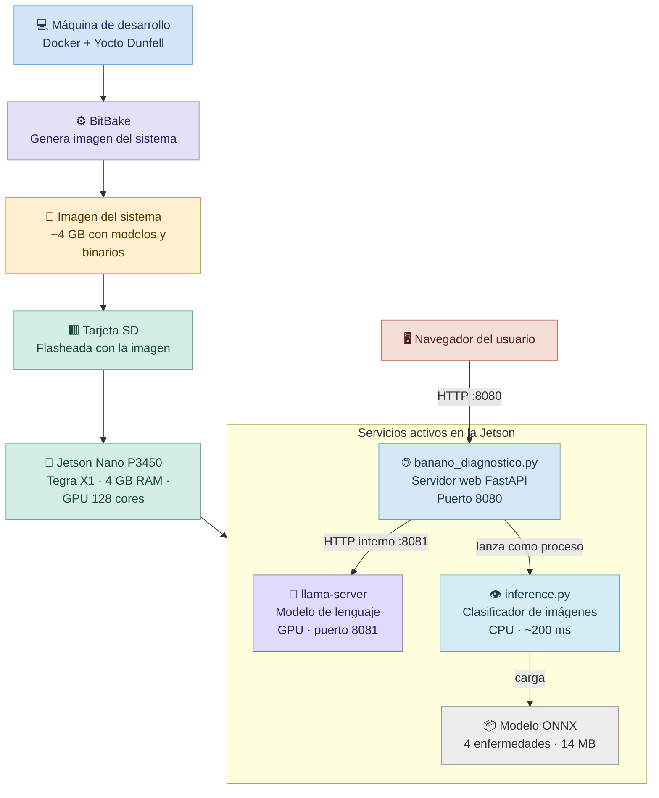
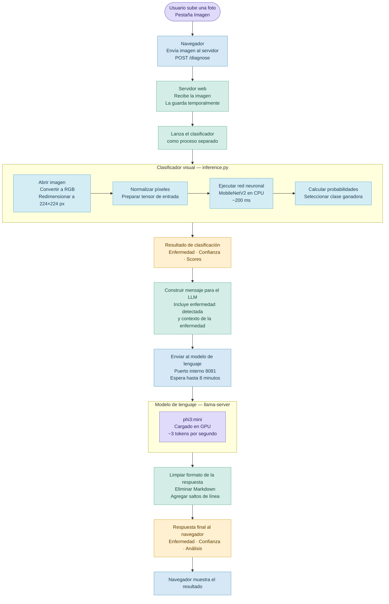
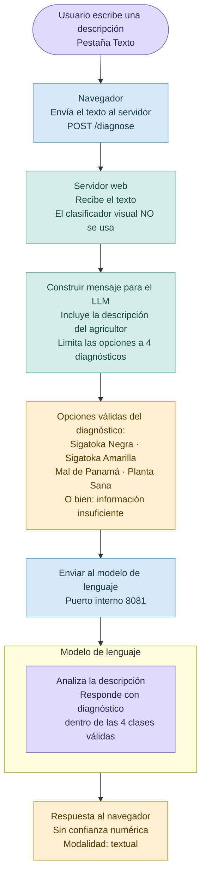
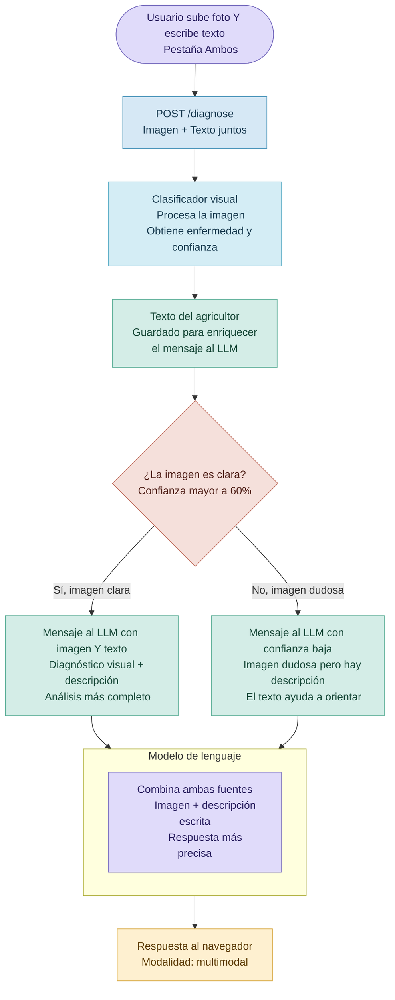
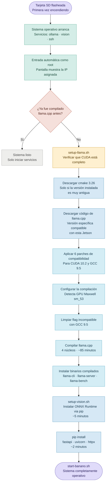
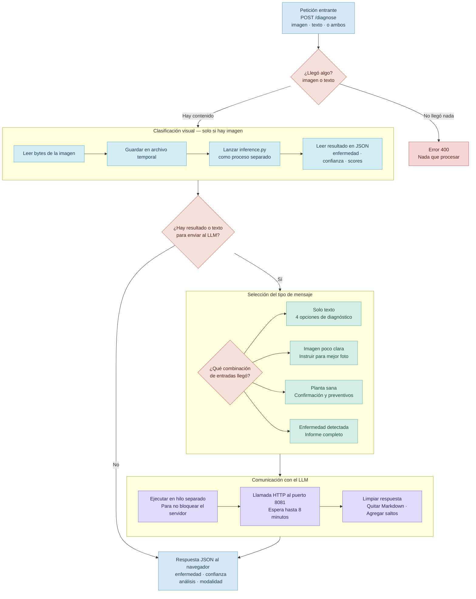

# Documentación del Sistema — Banano AI Diagnóstico
## Jetson Nano P3450 + Yocto Dunfell + llama.cpp + ONNX Runtime

---

## Índice
1. [Arquitectura general](#arquitectura-general)
2. [Archivos de Yocto (sistema de build)](#archivos-de-yocto)
3. [Scripts de configuración y arranque](#scripts-de-configuración-y-arranque)
4. [Aplicación web — banano_diagnostico.py](#banano_diagnosticopy)
5. [Motor de visión — inference.py](#inferencepy)
6. [Diagramas de flujo](#diagramas-de-flujo)

---

## Arquitectura general

El sistema tiene dos capas principales:

- **Capa de build (Yocto)**: genera la imagen del sistema operativo que se flashea en la SD.
- **Capa de runtime (Jetson)**: ejecuta los servicios de diagnóstico una vez el sistema arranca.

```
Máquina de desarrollo
└── Docker (Yocto Dunfell)
    ├── local.conf          → qué paquetes incluir
    ├── bblayers.conf       → qué capas de recetas usar
    └── meta-ai/            → recetas personalizadas
        ├── core-image-base.bbappend  → personalización de la imagen
        ├── recipes-ai/     → Ollama + modelos LLM
        ├── recipes-banano/ → backend web + frontend
        └── recipes-vision/ → clasificador ONNX + setup
              ↓ bitbake core-image-base
           imagen.tegraflash.tar.gz
              ↓ flashear SD
Jetson Nano P3450
├── llama-server (GPU, puerto 8081)   ← gemma2:2b / phi3:mini
├── banano_diagnostico.py (puerto 8080)
│   ├── /diagnose → inference.py → ONNX → MobileNetV2
│   └── /diagnose → LLM → llama-server
└── Navegador del usuario (puerto 8080)
```

---

## Archivos de Yocto

### `bblayers.conf`

Define qué **capas** de recetas conoce BitBake durante el build. Cada capa es un repositorio de recetas (instrucciones para compilar paquetes).

```bitbake
BBLAYERS ?= " \
  .../meta           # Capa base de Poky — recetas del sistema operativo base
  .../meta-poky      # Configuraciones específicas de la distribución Poky
  .../meta-yocto-bsp # Board Support Packages genéricos de Yocto
  .../meta-oe        # OpenEmbedded — paquetes extra (curl, python3-pillow, etc.)
  .../meta-python    # Paquetes Python (python3-pip, python3-numpy, etc.)
  .../meta-networking # Paquetes de red (dhcpcd, iproute2, etc.)
  .../meta-tegra     # Soporte específico Jetson — CUDA, L4T, nvgpu driver
  .../meta-ai        # Nuestras recetas personalizadas (Ollama, banano, vision)
```

Sin una capa en este archivo, BitBake no puede encontrar sus recetas.

---

### `local.conf`

Controla **cómo** se construye la imagen: qué máquina, qué paquetes instalar, cuántos hilos usar. Es la configuración más importante del build.

```bitbake
# ================================================================
#  local.conf — Yocto Dunfell | Jetson Nano P3450
# ================================================================


# ── Máquina, distribución y formato de paquetes ──────────────────
# jetson-nano-devkit: define arquitectura aarch64, kernel L4T 4.9.x
# y drivers propietarios NVIDIA (nvgpu, CUDA, bootloader).
MACHINE = "jetson-nano-devkit"

# poky: distribución base de Yocto. Define compilador, libc y políticas globales.
DISTRO = "poky"

# IPK: formato de paquete liviano compatible con opkg. Estándar en embebidos.
PACKAGE_CLASSES = "package_ipk"


# ── systemd como gestor de servicios ─────────────────────────────
# Reemplaza SysV init. Necesario para los .service files de
# ollama, banano-web y vision. Sintaxis _append obligatoria en Dunfell
# (en Kirkstone+ cambió a :append).
DISTRO_FEATURES_append = " systemd"
VIRTUAL-RUNTIME_init_manager = "systemd"
DISTRO_FEATURES_BACKFILL_CONSIDERED = "sysvinit"  # Evita restaurar SysV como fallback
VIRTUAL-RUNTIME_initscripts = ""                   # Deshabilita scripts init de SysV


# ── Zona horaria ──────────────────────────────────────────────────
# UTC-6 sin horario de verano. Requiere el paquete tzdata (instalado abajo).
DEFAULT_TIMEZONE = "America/Costa_Rica"


# ── Hardware ──────────────────────────────────────────────────────
# Habilita consola serie en UART (J41 pin 8/10). Útil para debug de boot
# cuando no hay HDMI disponible.
ENABLE_UART = "1"


# ── Características de la imagen ─────────────────────────────────
# empty-root-password + allow-empty-password: permiten login y SSH como
# root sin contraseña. La Jetson está en red local, no expuesta a internet.
# ssh-server-openssh: instala y activa sshd. configure_sshd() en el
# bbappend lo configura para aceptar root.
EXTRA_IMAGE_FEATURES += " \
    empty-root-password \
    ssh-server-openssh \
    allow-empty-password \
"


# ── Paquetes de red ───────────────────────────────────────────────
# dhcpcd: obtiene IP automáticamente via DHCP (ej. 10.42.0.203 desde la laptop).
# iproute2: herramientas modernas de red (ip, ss). Usado por show-ip.sh.
# iputils: ping y traceroute para diagnóstico.
# net-tools: ifconfig y netstat legacy para compatibilidad.
# curl: cliente HTTP. Útil para probar endpoints y descargar archivos.
IMAGE_INSTALL_append = " \
    dhcpcd \
    iproute2 \
    iputils \
    net-tools \
    curl \
"


# ── Utilidades base ───────────────────────────────────────────────
# tzdata: base de datos de zonas horarias para DEFAULT_TIMEZONE.
IMAGE_INSTALL_append = " tzdata"

# bash: requerido por setup-llama.sh (#!/bin/bash).
# vim/htop/procps/coreutils: herramientas esenciales de administración.
IMAGE_INSTALL_append = " bash vim htop procps coreutils"

# lsof: lista archivos abiertos y puertos en uso.
# file: identifica tipo de archivo por magic bytes.
# rsync/less: utilidades de transferencia y paginación.
IMAGE_INSTALL_append = " lsof file rsync less"


# ── Python 3 + paquetes Yocto ─────────────────────────────────────
# python3-pillow: requerido por inference.py para cargar y preprocesar imágenes.
# python3-pip: para instalar en primer arranque: fastapi, uvicorn,
#   httpx, python-multipart y onnxruntime (no están en Yocto Dunfell).
# python3-compression/json/asyncio: módulos stdlib necesarios para
#   FastAPI y la comunicación con llama-server.
IMAGE_INSTALL_append = " \
    python3 \
    python3-pip \
    python3-setuptools \
    python3-wheel \
    python3-pillow \
    python3-compression \
    python3-json \
    python3-asyncio \
"


# ── Ollama y dependencias de runtime ─────────────────────────────
# ollama: receta propia con binario + gemma2:2b prebaked.
# ca-certificates: certificados SSL para wget/git (setup-llama.sh los usa).
# libstdc++/libgcc/libgomp: requeridos por llama.cpp en runtime.
IMAGE_INSTALL_append = " ollama ca-certificates libstdc++ libgcc libgomp"


# ── Imagen de salida ──────────────────────────────────────────────
# ext4: filesystem del rootfs en la SD.
IMAGE_FSTYPES = "ext4"

# 8 GB extra para modelos LLM (~3.7 GB), llama.cpp compilado (~200 MB),
# pip packages y logs. Sin este espacio la Jetson se queda sin disco.
IMAGE_ROOTFS_EXTRA_SPACE = "8388608"

# Habilita el tipo de imagen tegraflash definido en meta-tegra.
IMAGE_CLASSES_append = " image_types_tegra"

# tegraflash: paquete flasheable con bootloader NVIDIA + filesystem.
# tar.gz: copia del rootfs para inspección sin flashear.
IMAGE_FSTYPES_pn-core-image-base = " tegraflash tar.gz"

# Deshabilita Wic (particionado alternativo). tegraflash gestiona
# el particionado de la Jetson por su cuenta.
WKS_FILE_pn-core-image-base = ""


# ── Licencias ─────────────────────────────────────────────────────
# WHITELIST en Dunfell (en Kirkstone+ es LICENSE_FLAGS_ACCEPTED).
# nv-tegra: acepta la EULA de NVIDIA para bootloader, CUDA y drivers Tegra.
# Sin esto BitBake rechaza compilar cualquier paquete propietario de NVIDIA.
LICENSE_FLAGS_WHITELIST = "commercial nv-tegra"

# Acepta la EULA para descargar binarios propietarios (CBoot, firmware GPU).
ACCEPT_EULA_jetson-nano-devkit = "1"


# ── Rendimiento de compilación ────────────────────────────────────
# 2 hilos de parseo (I/O intensivo), 4 tareas paralelas de BitBake,
# 4 compilaciones paralelas dentro de cada receta (make -j4).
BB_NUMBER_PARSE_THREADS = "2"
BB_NUMBER_THREADS = "4"
PARALLEL_MAKE = "-j 4"


# ── Directorios de caché ──────────────────────────────────────────
# DL_DIR: tarballs descargados. Sobrevive a borrar tmp/. Puede crecer varios GB.
DL_DIR ?= "${TOPDIR}/../downloads"

# SSTATE_DIR: artefactos compilados cacheados por hash.
# Si una receta no cambió, se restaura en segundos en lugar de recompilar.
SSTATE_DIR ?= "${TOPDIR}/../sstate-cache"

# TMPDIR: directorio de trabajo: fuentes, objetos, rootfs en construcción y logs.
TMPDIR = "${TOPDIR}/tmp"

# Versión del formato de local.conf. En Dunfell es "1" (Kirkstone+ usa "2").
CONF_VERSION = "1"


# ── CUDA runtime y desarrollo ─────────────────────────────────────
# cuda-cudart: libcudart.so — runtime CUDA en el dispositivo.
# cuda-driver: libcuda.so — interfaz con el driver del kernel nvgpu.
# cuda-libraries: libcublas, libcufft y otras. llama.cpp usa cuBLAS para GPU.
# tegra-tools: tegrastats y nvpmodel para monitorear GPU y energía.
IMAGE_INSTALL_append = " cuda-cudart cuda-driver cuda-libraries tegra-tools"

# cuda-cudart-dev: headers de desarrollo (cuda_runtime.h, libcudadevrt.a).
#   fix_cuda_symlinks en el bbappend copia cublas_v2.h y otros headers del
#   SDK desde el recipe-sysroot de cuda-libraries al rootfs.
# cuda-nvcc: compilador CUDA. fix_cuda_symlinks parchea host_config.h
#   para que acepte GCC 9.5 (CUDA 10.2 solo acepta GCC <= 8 por defecto).
IMAGE_INSTALL_append = " cuda-cudart-dev cuda-nvcc"

# tegra-libraries-cuda: libcuda.so real en L4T. Sin este, Ollama y
# llama-server no pueden inicializar la GPU en runtime.
IMAGE_INSTALL_append = " tegra-libraries-cuda"


# ── Toolchain para compilar llama.cpp on-device ───────────────────
# llama.cpp se compila en la Jetson (setup-llama.sh) porque nvcc
# requiere el GPU real para determinar la arquitectura correcta.
# packagegroup-core-buildessential: gcc, g++, make, glibc-dev, linux-headers.
IMAGE_INSTALL_append = " packagegroup-core-buildessential"

# Symlinks sin prefijo de arquitectura: /usr/bin/gcc → aarch64-poky-linux-gcc.
# Necesarios para scripts y cmake que asumen gcc en el PATH estándar.
IMAGE_INSTALL_append = " gcc-symlinks g++-symlinks binutils-symlinks"

# cmake: setup-llama.sh descarga cmake 3.26.4 si la versión instalada es < 3.18.
# git: setup-llama.sh clona llama.cpp desde GitHub en el primer arranque.
# wget: descarga cmake y paquetes pip en el primer arranque.
IMAGE_INSTALL_append = " cmake git wget"


# ── Vision AI ─────────────────────────────────────────────────────
# vision: receta propia con modelo ONNX + inference.py + setup-vision.sh.
# python3-numpy: dependencia base de onnxruntime para operaciones de tensor.
IMAGE_INSTALL_append = " vision python3-numpy"


# ── Aplicación web de diagnóstico ────────────────────────────────
# banano-web: receta con banano_diagnostico.py + frontend + start-banano.sh.
# banano-samples: 5 imágenes de ejemplo de enfermedades de banano.
IMAGE_INSTALL_append = " banano-web banano-samples"
```

---

### `core-image-base.bbappend`

Extiende la receta base de la imagen para agregar comportamiento personalizado durante la construcción del rootfs. Las funciones en `ROOTFS_POSTPROCESS_COMMAND` se ejecutan **después** de instalar todos los paquetes, modificando el rootfs antes de generar la imagen final.

```bitbake
IMAGE_INSTALL_append = " autologin show-ip ollama"
# Agrega tres paquetes propios al sistema:
# - autologin: entra automáticamente como root en tty1 sin contraseña
# - show-ip: muestra la IP al hacer login (útil para encontrar la Jetson en la red)
# - ollama: servidor de LLMs con los modelos pre-instalados

ROOTFS_POSTPROCESS_COMMAND_append = " \
    configure_sshd; \    # Permite SSH como root sin contraseña
    enable_timesyncd; \  # Activa sincronización de hora automática
    fix_cuda_symlinks; \ # Configura toda la infraestructura CUDA
    install_ollama_env; \ # Variables de entorno para Ollama
    install_setup_script; \ # Copia setup-llama.sh al rootfs
"
```

#### `configure_sshd`
```bash
# Modifica /etc/ssh/sshd_config para:
# - Permitir login como root (por defecto está bloqueado)
# - Permitir contraseña vacía (la imagen no tiene contraseña)
# - Deshabilitar PAM (no necesario en este contexto)
sed -i 's/^#*PermitRootLogin.*/PermitRootLogin yes/' "${SSHD_CONFIG}"
sed -i 's/^#*PermitEmptyPasswords.*/PermitEmptyPasswords yes/' "${SSHD_CONFIG}"
sed -i 's/^#*UsePAM.*/UsePAM no/' "${SSHD_CONFIG}"
```

#### `fix_cuda_symlinks`
Esta es la función más crítica del bbappend. Soluciona 5 problemas de compatibilidad entre CUDA 10.2, GCC 9.5 y Yocto Dunfell:

```bash
# PROBLEMA 1: Symlinks de librerías
# Los paquetes instalan libcudart.so.10.2 pero el linker necesita
# libcudart.so (sin versión) para resolver -lcudart al compilar llama.cpp.
for versioned in "${CUDA_LIB}"/lib*.so.[0-9]*; do
    ln -sf "$(basename ${versioned})" "${CUDA_LIB}/${base}"
done

# PROBLEMA 2: ldconfig
# Sin este archivo, el linker dinámico no sabe dónde buscar las CUDA libs en runtime.
echo "/usr/local/cuda-10.2/lib" > "${IMAGE_ROOTFS}/etc/ld.so.conf.d/cuda.conf"

# PROBLEMA 3: arm_bf16.h faltante
# GCC 9 no incluye este header. llama.cpp b5050 lo necesita aunque
# el Cortex-A57 (ARMv8.0) no tenga instrucciones BF16 nativas.
cat > "${GCC_INC}/arm_bf16.h" << 'BFEOF'
typedef unsigned short bfloat16_t;
# Se mapea a unsigned short (16 bits) como stub funcional.

# PROBLEMA 4: Symlink lib64
# nvcc busca sus libdevice en lib64/ por defecto, pero L4T las pone en lib/
ln -sf /usr/local/cuda-10.2/lib "${IMAGE_ROOTFS}/usr/local/cuda-10.2/lib64"

# PROBLEMA 5: cuda_bf16.h faltante
# CUDA 10.2 no incluye soporte BFloat16 (requiere CUDA 11+ / Ampere).
# llama.cpp b5050 lo incluye en vendors/cuda.h aunque Maxwell (sm_53)
# no tenga hardware BF16. Se mapea nv_bfloat16 → half (FP16) como alias.
typedef half nv_bfloat16;
typedef half2 nv_bfloat162;

# COPIA DEL SDK COMPLETO (cublas_v2.h y otros headers)
# cuda-cudart-dev solo instala headers de cudart, no del SDK completo.
# Los headers de cublas están en el recipe-sysroot de cuda-libraries
# (disponible en build time pero no instalado en el rootfs por defecto).
for _cuda_inc in ${TMPDIR}/work/*-poky-linux/cuda-libraries/*/recipe-sysroot/.../include; do
    cp -rf "${_cuda_inc}/"* "${IMAGE_ROOTFS}/usr/local/cuda-10.2/include/"
done

# PARCHE host_config.h — SIEMPRE AL FINAL
# CUDA 10.2 rechaza GCC > 8 con un #error en tiempo de compilación.
# El cp anterior puede sobreescribir el archivo, así que el parche
# siempre se aplica después de cualquier copia.
sed -i 's/__GNUC__ > 8/__GNUC__ > 9/' "${HOST_CFG}"
# Cambia el umbral de 8 a 9: GCC 9.5 tiene __GNUC__==9, y 9>9 es falso → OK
```

---

### `ollama_1.0.bb`

Receta que instala Ollama (el servidor de LLMs) con el modelo gemma2:2b pre-instalado.

```bitbake
SRC_URI = " \
    file://ollama-linux-arm64.tar.gz  # Binario de Ollama para ARM64
    file://ollama.service             # Servicio systemd
    file://gemma2-2b-prebaked.tar.gz  # Modelo gemma2:2b en formato Ollama
"

do_install() {
    # El binario se instala en /usr/bin/ollama
    install -m 0755 .../ollama ${D}${bindir}/ollama

    # El modelo se desempaqueta en /root/.ollama/
    # Esta es la ruta que Ollama usa para buscar modelos.
    tar --no-same-owner -xzf gemma2-2b-prebaked.tar.gz -C ${D}/root/.ollama/
}
```

El `ollama.service` lo arranca automáticamente pero no es el que usamos para las inferencias. Las inferencias van directo por `llama-server` (llama.cpp) que tiene mejor control de memoria y GPU.

---

### `autologin_1.0.bb` y `autologin.conf`

Configura el sistema para entrar automáticamente como root en la consola serial/HDMI.

```ini
# autologin.conf — override del servicio getty@tty1
[Service]
ExecStart=
# La línea vacía borra el ExecStart heredado de getty@tty1.service

ExecStart=-/sbin/agetty --autologin root --noclear %I $TERM
# --autologin root: entra como root sin pedir contraseña
# %I: se expande al nombre del terminal (tty1)
# Type=idle: espera a que el sistema termine de arrancar antes de mostrar el prompt
```

---

### `show-ip_1.0.bb` y `99-show-ip.sh`

Muestra la IP de la Jetson al hacer login, necesario para conectarse por SSH sin conocer la IP de antemano.

```bash
# 99-show-ip.sh — se ejecuta al abrir cualquier sesión shell
# Prefijo "99-" garantiza que corra al final (los scripts en profile.d
# se ejecutan en orden alfabético).

for iface in eth0 eth1 wlan0; do
    IP=$(ip -4 addr show "$iface" ...)
    # Muestra algo como:
    # | eth0   ->  ssh root@10.42.0.203      |
done
```

---

## Scripts de configuración y arranque

### `setup-llama.sh`

Script de compilación on-device de llama.cpp. Se ejecuta manualmente en el primer arranque con internet disponible. Tarda ~85 minutos.

**Flujo del script:**

```bash
# PASO 1: Verificar prerequisitos CUDA
# Comprueba que existan todos los headers y librerías necesarias.
# Si falta alguno, la imagen no se generó correctamente.
for req in cuda_runtime.h cublas_v2.h libcudadevrt.a ...; do
    [ ! -f "$req" ] && exit 1
done

# PASO 2: Descargar cmake 3.26.4
# La Jetson tiene cmake 3.x pero llama.cpp b5050 requiere >= 3.18.
# Se descarga el binario ARM64 precompilado de Kitware.
wget cmake-3.26.4-linux-aarch64.tar.gz
tar -xzf ... -C /usr/local/

# PASO 3: Clonar llama.cpp al commit exacto b5050 (23106f94e)
# Se usa un commit específico porque versiones más nuevas podrían
# requerir CUDA 11+ o cambiar la API y romper la compatibilidad.
git clone https://github.com/ggml-org/llama.cpp
git checkout 23106f9

# PASO 4: Seis parches de compatibilidad
# Parche 1: Forzar arquitectura CUDA sm_53 en CMakeLists.txt
#   Maxwell (sm_53) no está en la lista por defecto de versiones nuevas de llama.cpp
sed -i '14a if(Not DEFINED ${CMAKE_CUDA_ARCHITECTURES})...' CMakeLists.txt

# Parche 2: Agregar flag de linker en ggml/CMakeLists.txt
#   --copy-dt-needed-entries resuelve dependencias transitivas de librerías CUDA
sed -i '.../ggml PROPERTIES/a add_link_options(-Wl,--copy-dt-needed-entries)' ggml/CMakeLists.txt

# Parches 3-6: Deshabilitar __builtin_assume en archivos CUDA
#   Esta función de GCC optimiza código asumiendo condiciones verdaderas,
#   pero nvcc 10.2 no la soporta en código CUDA (host/device).
sed -i '455s/static constexpr __device__/static __device__/' ggml/src/ggml-cuda/common.cuh
sed -i '623s/__builtin_assume/\/\/__builtin_assume/' ggml/src/ggml-cuda/fattn-common.cuh
# ... etc.

# PASO 5: cmake + limpieza de -lstdc++fs + cmake --build
cmake -B build \
    -DGGML_CUDA=ON \              # Habilitar backend CUDA
    -DCMAKE_CUDA_ARCHITECTURES=53 \ # Maxwell sm_53
    -DCMAKE_CUDA_RUNTIME_LIBRARY=SHARED \ # Usar libcudart.so dinámica
    ...

# CRÍTICO: limpiar -lstdc++fs del Makefile generado
# cmake 3.26 a veces agrega -lstdc++fs para std::filesystem.
# En GCC 9.5, libstdc++fs está integrada en libstdc++ y no existe
# como librería separada. El linker falla si se incluye.
find build/ -type f | xargs grep -l "stdc++fs" | \
    while read f; do sed -i 's/-lstdc++fs//g' "$f"; done

cmake --build build --config Release -j4  # Compilar con 4 cores
install -m 0755 build/bin/llama-* /usr/local/bin/
```

---

### `setup-vision.sh`

Instala ONNX Runtime en el primer arranque para el motor de visión.

```bash
# Verifica si ya está instalado para no repetir
if python3 -c "import onnxruntime" 2>/dev/null; then exit 0; fi

# Versiones específicas y compatibles:
# - onnxruntime 1.16.3: última versión con wheels para cp38-aarch64
# - numpy 1.24.4: última versión disponible para cp38-aarch64 en PyPI
#   (numpy 1.26+ solo existe para Python 3.9+)
pip3 install --no-cache-dir onnxruntime==1.16.3 numpy==1.24.4

# Prueba de carga del modelo ONNX para verificar que todo funciona
python3 -c "
import onnxruntime as ort
session = ort.InferenceSession('/opt/vision/models/banana_disease_classifier.onnx', ...)
"
```

---

### `start-banano.sh`

Script de inicio del sistema completo de diagnóstico. Arranca primero llama-server y luego banano-web.

```bash
export LD_LIBRARY_PATH=/usr/local/cuda-10.2/lib:/usr/lib:$LD_LIBRARY_PATH
# CUDA libs no están en el LD_LIBRARY_PATH por defecto en Yocto.
# Sin esto, llama-server no puede cargar libcudart.so y corre en CPU.

# Limpiar procesos anteriores para liberar GPU y puertos
pkill -9 -f banano_diagnostico 2>/dev/null
pkill -9 -f uvicorn 2>/dev/null
pkill -9 -f llama-server 2>/dev/null
pkill -9 -f llama-cli 2>/dev/null
sleep 2

# Encontrar el modelo más grande en /root/.ollama/models/blobs/
# Los blobs de Ollama son hashes SHA256 sin extensión.
# El modelo GGUF (pesos) es el archivo más grande.
# phi3:mini (2.03 GB) > gemma2:2b (1.6 GB), así que se selecciona automáticamente.
MODEL=$(for f in /root/.ollama/models/blobs/*; do
    echo "$(wc -c < $f 2>/dev/null) $f"
done | sort -rn | head -1 | awk '{print $2}')

llama-server \
    --model "$MODEL" \
    --n-gpu-layers 99 \  # Cargar todas las capas en GPU (Maxwell 128 cores)
    -c 1024 \            # Contexto: prompt (~250 tokens) + respuesta (~600 tokens)
    -ub 64 \             # Micro-batch size: reduce buffer de cómputo temporal
    --host 127.0.0.1 \   # Solo escucha localmente (no expuesto al exterior)
    --port 8081 \        # Puerto interno para banano_diagnostico.py
    --no-warmup \        # Omitir el pase de calentamiento (3-5 min en Maxwell)
    --log-disable &      # Suprimir logs de llama.cpp para no contaminar el output

# Esperar hasta 90 segundos a que llama-server esté listo
# La carga del modelo en GPU tarda ~6-10 segundos para gemma2:2b
i=0
while [ $i -lt 90 ]; do
    if python3 -c "import urllib.request; urllib.request.urlopen('http://127.0.0.1:8081/health', timeout=2)" 2>/dev/null; then
        echo "[start-banano] llama-server listo en ${i}s"
        break
    fi
    i=$((i + 2)); sleep 2
done

cd /opt/banano-web
python3 backend/banano_diagnostico.py
# FastAPI con uvicorn en puerto 8080
```

---

## banano_diagnostico.py

El archivo central del sistema. Es un servidor web FastAPI que orquesta los dos motores de IA: ONNX (visión) y llama-server (lenguaje). Maneja tres tipos de petición según qué envíe el usuario.

### Constantes de configuración

```python
INFERENCE_SCRIPT     = "/opt/vision/bin/inference.py"
VISION_MODEL         = "/opt/vision/models/banana_disease_classifier.onnx"
STATIC_DIR           = "/opt/banano-web/static"
LLM_URL              = "http://127.0.0.1:8081"
CONFIDENCE_THRESHOLD = 0.60
# Si la confianza del modelo visual es < 60%, probablemente no es una
# hoja de banano o la imagen no tiene buena calidad.

LLM_MAX_TOKENS = 600
# phi3:mini genera ~3 tokens/segundo → 600 tokens ≈ 3-4 minutos
# gemma2:2b genera ~4 tokens/segundo → 600 tokens ≈ 2-3 minutos

LLM_TIMEOUT = 480
# 8 minutos: tiempo máximo para esperar la respuesta del LLM
# Necesario porque el prompt más largo puede tardar hasta 6 minutos
```

### `DISEASE_CONTEXT`

```python
DISEASE_CONTEXT = {
    "Black Sigatoka": "Sigatoka Negra causada por Mycosphaerella fijiensis...",
    "Yellow Sigatoka": "Sigatoka Amarilla causada por Mycosphaerella musicola...",
    "Panama Disease":  "Mal de Panamá causado por Fusarium oxysporum cubense...",
    "Healthy":         "planta sin signos visibles de enfermedad",
}
# Contexto técnico de cada enfermedad para enriquecer los prompts.
# Se incluye en el prompt para que el LLM tenga información de fondo
# sin necesidad de que el modelo "recuerde" todo por sí solo.
```

### `run_vision_inference(image_bytes)`

```python
def run_vision_inference(image_bytes: bytes) -> dict:
    # 1. Guarda la imagen en un archivo temporal (/tmp/tmpXXXXXX.jpg)
    with tempfile.NamedTemporaryFile(suffix=".jpg", delete=False) as tmp:
        tmp.write(image_bytes)
        tmp_path = tmp.name

    # 2. Llama a inference.py como subprocess separado
    # Por qué subprocess y no import directo?
    # - ONNX Runtime con Python 3.8 tiene problemas de compatibilidad
    #   al cargar desde un proceso asyncio (FastAPI).
    # - El subprocess corre en un proceso limpio sin conflictos de event loop.
    result = subprocess.run(
        ["python3", INFERENCE_SCRIPT, tmp_path, "--model", VISION_MODEL],
        capture_output=True, text=True, timeout=30
    )

    # 3. inference.py imprime JSON a stdout, aquí lo parseamos
    return json.loads(result.stdout.strip())
    # Ejemplo: {"disease": "Black Sigatoka", "confidence": 0.923, "all_scores": {...}}

    # 4. El archivo temporal se borra siempre, incluso si hay error
    os.unlink(tmp_path)  # en el finally
```

### `build_llm_prompt(disease, confidence, user_text)`

La función más compleja. Genera prompts distintos para los 4 escenarios posibles.

```python
def build_llm_prompt(disease, confidence, user_text=None):
    no_markdown = "IMPORTANTE: responde SOLO en texto plano..."
    # Se incluye en todos los prompts porque los LLMs tienden a usar
    # formato Markdown (asteriscos, guiones) aunque no se les pida.

    # ── ESCENARIO A: Solo texto, sin imagen ──────────────────────────────────
    if disease == "Indeterminado" and user_text:
        # El agricultor describe síntomas en texto, sin foto.
        # El LLM debe diagnosticar SOLO entre las 4 clases del modelo visual
        # para mantener consistencia con el resto del sistema.
        return f"""...
        No puedes sugerir ninguna otra enfermedad fuera de estas cuatro opciones:
        1. Sigatoka Negra
        2. Sigatoka Amarilla
        3. Mal de Panama (Fusarium)
        4. Planta Sana
        Si no hay suficiente información, di que no puedes diagnosticar...
        """

    # ── ESCENARIO B: Imagen con confianza baja (posible no-banano) ───────────
    if confidence < CONFIDENCE_THRESHOLD:
        # El modelo visual no está seguro de qué es la imagen.
        # El LLM le explica al agricultor por qué y cómo mejorar la foto.
        # Si hay texto adicional, lo usa para orientar mejor.
        base = f"...confianza muy baja ({confidence:.0%})..."
        if user_text:
            base += f"Sin embargo, el agricultor describe: '{user_text}'..."
        return base

    # ── ESCENARIO C: Planta sana (con o sin texto) ───────────────────────────
    if disease == "Healthy":
        # Confirmación positiva + recomendaciones preventivas
        base = f"...confirmó que la planta está SANA con {confidence:.0%}..."
        if user_text:
            base += f"Adicionalmente, el agricultor describe: '{user_text}'..."
        return base

    # ── ESCENARIO D: Enfermedad detectada (con o sin texto) ──────────────────
    # Caso principal: ONNX detectó una de las 3 enfermedades
    context = DISEASE_CONTEXT.get(disease, disease)
    base = f"...detectó {disease} con {confidence:.0%} de confianza..."
    if user_text:
        base += f"Adicionalmente, el agricultor describe: '{user_text}'..."
        # El texto del agricultor puede confirmar o matizar el diagnóstico visual
    base += """
    DESCRIPCION DE LA ENFERMEDAD: ...
    SINTOMAS VISIBLES: 4 síntomas...
    NIVEL DE URGENCIA: ...
    TRATAMIENTO: 4 pasos...
    PREVENCION: 3 medidas...
    IMPACTO ECONOMICO: ...
    """
    return base
```

### `strip_markdown(text)`

```python
def strip_markdown(text: str) -> str:
    # Problema: los LLMs usan Markdown incluso cuando se les pide que no.
    # En HTML, **negrita** se muestra literal, no como negrita.
    # Solución: post-procesar el texto antes de enviarlo al frontend.

    # Quitar formato de caracteres
    text = re.sub(r'\*\*(.+?)\*\*', r'\1', text)  # **texto** → texto
    text = re.sub(r'\*(.+?)\*',     r'\1', text)  # *texto*   → texto
    text = re.sub(r'__(.+?)__',     r'\1', text)  # __texto__ → texto
    text = re.sub(r'_(.+?)_',       r'\1', text)  # _texto_   → texto
    text = re.sub(r'^#{1,6}\s+',    '', text, flags=re.MULTILINE)  # # Título → Título
    text = re.sub(r'`(.+?)`',       r'\1', text)  # `código`  → código

    # Agregar saltos de línea antes de títulos en MAYÚSCULAS
    # "TRATAMIENTO: 1. Paso..." → "\n\nTRATAMIENTO:\n1. Paso..."
    text = re.sub(r'\s{0,2}([A-ZÁÉÍÓÚÑ][A-ZÁÉÍÓÚÑ\s]{3,}:)', r'\n\n\1', text)

    # Agregar salto antes de ítems numerados
    text = re.sub(r'\s+(\d+\.)\s', r'\n\1 ', text)

    return text.strip()
```

### `_call_llm_sync(prompt)` y `call_llm(prompt)`

```python
def _call_llm_sync(prompt: str):
    # Función SINCRÓNICA que llama a llama-server via HTTP.
    # Usa urllib.request en lugar de httpx porque httpx async
    # falla en el entorno de red de Yocto (anyio/backend issue).

    payload = json.dumps({
        "model":       "gemma2",        # El nombre del modelo (llama-server lo ignora,
                                        # usa el que se cargó al arrancar)
        "messages":    [{"role": "user", "content": prompt}],
        "max_tokens":  LLM_MAX_TOKENS,  # 600 tokens ≈ 3-4 minutos en Jetson
        "temperature": 0.3,             # Baja temperatura = respuestas más consistentes
                                        # Alta temperatura = más creativo pero menos preciso
        "stream":      False            # Esperar respuesta completa (no streaming)
    }).encode()

    # Llama al endpoint OpenAI-compatible de llama-server
    req = urlreq.Request(
        f"{LLM_URL}/v1/chat/completions",  # Puerto 8081, solo localhost
        data=payload,
        headers={"Content-Type": "application/json"}
    )
    with urlreq.urlopen(req, timeout=LLM_TIMEOUT) as r:
        data = json.loads(r.read())
        return strip_markdown(data["choices"][0]["message"]["content"])


async def call_llm(prompt: str):
    # FastAPI es async. Si llamamos directamente a _call_llm_sync desde
    # un endpoint async, bloqueamos el event loop durante 3-5 minutos
    # y ninguna otra petición puede procesarse.
    # run_in_executor ejecuta la función síncrona en un thread separado,
    # devolviendo el control al event loop mientras espera.
    loop = asyncio.get_event_loop()
    return await loop.run_in_executor(None, _call_llm_sync, prompt)
```

### Endpoint `/diagnose`

```python
@app.post("/diagnose")
async def diagnose(image: UploadFile = File(None), text: str = Form(None)):
    # Acepta multipart/form-data con:
    # - image: archivo de imagen (opcional)
    # - text: descripción textual (opcional)
    # Al menos uno de los dos debe estar presente.

    user_text = text.strip() if text and text.strip() else None

    # ── ONNX solo si hay imagen ───────────────────────────────────────────────
    if image:
        image_bytes = await image.read()
        vision_result = run_vision_inference(image_bytes)
        disease    = vision_result.get("disease",    "Indeterminado")
        confidence = vision_result.get("confidence", 0.0)  # float 0.0-1.0
        all_scores = vision_result.get("all_scores", {})   # scores de las 4 clases
    # Si no hay imagen: disease="Indeterminado", confidence=0.0

    # ── LLM si hay algo que analizar ─────────────────────────────────────────
    if disease != "Indeterminado" or user_text:
        # Al menos uno: imagen clasificada O texto del agricultor
        prompt = build_llm_prompt(disease, confidence, user_text)
        recomendacion = await call_llm(prompt)  # ~3-5 minutos

    # ── Determinar modalidad para el frontend ─────────────────────────────────
    modalidad = "multimodal" if (image and user_text) else \
                "textual"    if user_text else \
                "visual"

    return {
        "enfermedad":    disease if image else "Análisis por descripción",
        "confianza":     round(confidence, 4) if image else None,
        "imagen_valida": (confidence >= CONFIDENCE_THRESHOLD) if image else None,
        "all_scores":    all_scores,          # Distribución completa de probabilidades
        "recomendacion": recomendacion or "Servicio LLM no disponible",
        "llm_activo":    recomendacion is not None,
        "modalidad":     modalidad
    }
```

### Endpoint `/health`

```python
@app.get("/health")
async def health():
    # Verifica los tres componentes del sistema:
    # 1. ¿Existe el archivo del modelo ONNX?
    model_ok = Path(VISION_MODEL).exists()

    # 2. ¿Está instalado onnxruntime?
    try: import onnxruntime; onnx_ok = True
    except ImportError: onnx_ok = False

    # 3. ¿Está respondiendo llama-server? (GET /health → {"status":"ok"})
    try:
        with urlreq.urlopen(f"{LLM_URL}/health", timeout=3) as r:
            llm_ok = json.loads(r.read()).get("status") == "ok"
    except: llm_ok = False
    # Puerto 8081 solo escucha en localhost → no accesible desde fuera

    return {"status": "online", "onnx_model": model_ok,
            "onnxruntime": onnx_ok, "llm_server": llm_ok}
```

---

## inference.py

Script independiente de clasificación visual. Se ejecuta como subprocess por `banano_diagnostico.py`.

```python
CLASSES = ["Black Sigatoka", "Healthy", "Panama Disease", "Yellow Sigatoka"]
# Orden CRÍTICO: debe coincidir exactamente con el orden en que el modelo
# fue entrenado. Si el orden fuera diferente, "Healthy" podría clasificarse
# como "Black Sigatoka". Confirmado por model_info.json del tar.gz.

IMAGENET_MEAN = [0.485, 0.456, 0.406]
IMAGENET_STD  = [0.229, 0.224, 0.225]
# Normalización estándar de ImageNet. MobileNetV2 fue pre-entrenado con
# ImageNet y fine-tuneado en hojas de banano. Se mantiene la normalización
# del pre-entrenamiento para preservar las features aprendidas.

def preprocess(image_path):
    img = Image.open(image_path).convert("RGB")
    # .convert("RGB"): elimina canal alpha si la imagen es PNG (RGBA → RGB)
    # MobileNetV2 espera exactamente 3 canales.

    img = img.resize((224, 224), Image.BILINEAR)
    # 224x224: tamaño estándar de entrada de MobileNetV2.
    # BILINEAR: interpolación suave para redimensionar.

    arr = np.array(img, dtype=np.float32) / 255.0
    # Normalizar a [0.0, 1.0] dividiendo por 255 (máximo valor uint8)

    arr = (arr - IMAGENET_MEAN) / IMAGENET_STD
    # Normalización z-score por canal.
    # Resultado: cada canal tiene distribución ~N(0,1)

    arr = arr.transpose(2, 0, 1)
    # HWC (Height, Width, Channels) → CHW (Channels, Height, Width)
    # PyTorch/ONNX usan CHW, PIL/numpy usan HWC.

    arr = np.expand_dims(arr, axis=0)
    # Agregar dimensión de batch: CHW → NCHW (N=1 imagen)
    # ONNX Runtime espera tensor de forma (1, 3, 224, 224)
    return arr

def predict(image_path, model_path):
    session = ort.InferenceSession(model_path,
        providers=["CPUExecutionProvider"])
    # CPUExecutionProvider: inferencia en CPU.
    # ~200ms por imagen para MobileNetV2 en Cortex-A57.
    # La GPU (CUDA) está ocupada con llama-server.

    outputs = session.run(None, {input_name: input_data})
    logits  = outputs[0][0]  # shape: (4,) — un score por clase
    # Los logits no son probabilidades: pueden ser negativos y no suman 1.

    probs = softmax(logits)
    # softmax: convierte logits a probabilidades que suman 1.
    # e^xi / Σe^xj — amplifica diferencias, clase más probable → prob cercana a 1.

    class_idx = int(np.argmax(probs))
    # La clase con mayor probabilidad es el diagnóstico.
```

---

# Diagramas de flujo — Sistema Banano AI

---

### Diagrama 1 — Arquitectura completa del sistema



---

### Diagrama 2 — Petición con solo imagen



---

### Diagrama 3 — Petición con solo texto



---

### Diagrama 4 — Petición con imagen y texto



---

### Diagrama 5 — Primer arranque de la Jetson



---

### Diagrama 6 — Flujo interno de banano_diagnostico.py

