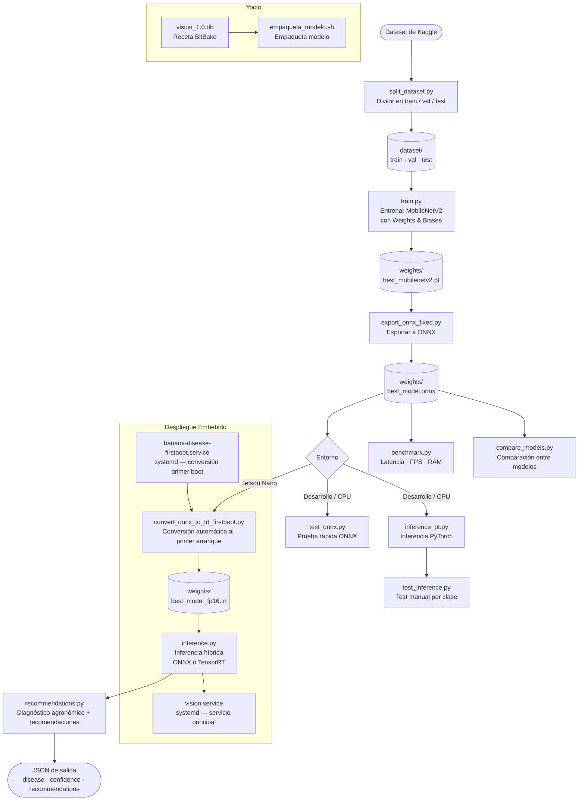

# Vison — Detección de Enfermedades en Hojas de Banano

Sistema de visión artificial para clasificación de enfermedades en hojas de banano, optimizado para correr en **Jetson Nano** con inferencia vía ONNX Runtime y TensorRT.

## Clases detectadas

| Clase | Descripción |
|---|---|
| `Healthy` | Hoja sana |
| `Black Sigatoka` | Sigatoka Negra |
| `Yellow Sigatoka` | Sigatoka Amarilla |
| `Panama` | Mal de Panamá |

---

## Flujo del proyecto



---

## Requisitos

```bash
pip install torch torchvision onnx onnxruntime wandb \
            numpy pillow scikit-learn matplotlib seaborn psutil
```

En Jetson Nano se requiere adicionalmente: `tensorrt`, `pycuda`.

---

## Instrucciones paso a paso

### 1. Preparar el dataset

Descarga el dataset desde Kaggle y colócalo en `dataset/raw/`, luego:

```bash
# Distribuir imagenes
python3 split_dataset.py
```
```
Nota: El set de satos de Kaggle ya esta clasificado y etiquetado, por lo que se utiliza split_data.py para distribuir las imagenes para hacer el train.
```

Genera la estructura:
```
dataset/
├── train/
├── val/
└── test/
```

---

### 2. Entrenar el modelo


Usa Weights & Biases para tracking. Para correr un sweep de hiperparámetros:

```bash
wandb sweep sweep.yaml
wandb agent Proyecto1_Embebidos/banana-disease/<sweep_id>
```
```bash
python3 train.py
```


Genera:
- `weights/best_mobilenetv2.pt` — mejor modelo por accuracy de validación
- `weights/final_mobilenetv2.pt` — modelo al finalizar entrenamiento
- `results/confusion_matrix.png`
- `results/classification_report.txt`

---

### 3. Exportar a ONNX

```bash
python3 export_onnx.py
```

Genera: `weights/best_model.onnx`

---

### 4. Probar inferencia (desarrollo)

**Con modelo PyTorch (.pt):**
```bash
# Por clase (toma la primera imagen del test set)
python3 test_inference.py Healthy
python3 test_inference.py "Black Sigatoka"
python3 test_inference.py Panama
python3 test_inference.py "Yellow Sigatoka"
```

**Con modelo ONNX:**
```bash
# Inferencia en una imagen
python3 test_onnx.py Healthy
python3 test_onnx.py "Black Sigatoka"
python3 test_onnx.py Panama
python3 test_onnx.py "Yellow Sigatoka"

# Benchmark de rendimiento en CPU
python3 test_onnx.py benchmark
python3 test_onnx.py benchmark --n 200
```

**Con modelo ONNX directamente:**
```bash
python3 inference.py dataset/test/Healthy/imagen.jpg
```

---

### 5. Convertir a TensorRT (Jetson Nano)

**Conversión manual con opciones avanzadas:**
```bash
# FP16 (recomendado)
python3 convert_tensorrt.py --onnx weights/best_model.onnx --precision fp16

# INT8 con imágenes de calibración
python3 convert_tensorrt.py \
    --onnx weights/best_model.onnx \
    --precision int8 \
    --calibration-images dataset/val/
```

**Conversión automática en primer arranque** (usada por el servicio systemd):
```bash
python3 convert_onnx_to_trt_firstboot.py
```

Genera: `weights/best_model_fp16.trt`

---

### 6. Benchmark de rendimiento (Jetson Nano)

```bash
python3 benchmark.py --engine weights/best_model_fp16.trt
python3 benchmark.py --engine weights/best_model_fp16.trt --iterations 200 --plot
```

Genera: `benchmark_results.json` y opcionalmente un histograma de latencias.

Restricciones del proyecto:
- Latencia < 3000 ms
- RAM < 3.5 GB

---

### 7. Comparar modelos

```bash
python3 compare_models.py
```

---

### 8. Generar recomendaciones agronómicas

A partir del JSON de salida de `inference.py`:

```bash
# Modo test
python3 recommendations.py test

# Desde archivo JSON
python3 recommendations.py resultado.json

# Desde stdin (pipeline)
python3 inference.py imagen.jpg | python3 recommendations.py -

# Con output JSON adicional
python3 recommendations.py resultado.json --json
```

---

### 9. Despliegue en Yocto (Jetson Nano)

Empaquetar el modelo:
```bash
bash empaqueta_modelo.sh
```

La imagen embebida incluye dos servicios systemd:

- `banana-disease-firstboot.service` — convierte ONNX → TensorRT en el primer arranque
- `vision.service` — servicio principal de inferencia

---

## Estructura del proyecto

```
Vison/
├── dataset/               # Dataset (no incluido en repo)
│   ├── train/
│   ├── val/
│   └── test/
├── weights/               # Modelos entrenados
│   ├── best_mobilenetv2.pt
│   ├── best_model.onnx
│   └── best_model_fp16.trt
├── results/               # Métricas y gráficos generados
├── yocto_files/           # Archivos de configuración Yocto
├── train.py               # Entrenamiento MobileNetV2
├── split_dataset.py       # División del dataset
├── export_onnx_fixed.py   # Exportación a ONNX
├── convert_tensorrt.py    # Conversión a TensorRT (manual)
├── convert_onnx_to_trt_firstboot.py  # Conversión automática (systemd)
├── inference.py           # Inferencia híbrida ONNX/TensorRT
├── inference_pt.py        # Inferencia PyTorch (desarrollo)
├── test_inference.py      # Test rápido por clase (usa inference_pt.py)
├── test_onnx.py           # Test y benchmark ONNX en CPU
├── benchmark.py           # Benchmark TensorRT en Jetson
├── compare_models.py      # Comparación entre modelos
├── recommendations.py     # Sistema de recomendaciones agronómicas
├── sweep.yaml             # Configuración W&B sweep
├── vision.service         # Servicio systemd principal
├── banana-disease-firstboot.service  # Servicio systemd primer boot
├── vision_1.0.bb          # Receta BitBake para Yocto
└── empaqueta_modelo.sh    # Script de empaquetado
```

---

## Dataset

- [BananaLSD Models — Kaggle](https://www.kaggle.com/code/syednazmussakib/bananalsd-models)
- [Banana Disease Recognition Dataset — Kaggle](https://www.kaggle.com/datasets/sujaykapadnis/banana-disease-recognition-dataset)